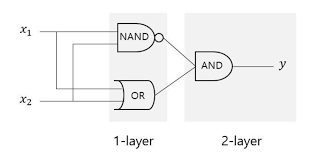
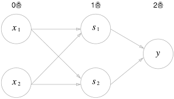

# 퍼셉트론

## 2.1 퍼셉트론이란 ?
- 퍼셉트론은 다수의 신호를 입력으로 받아 하나의 신호로 출력
- 전류가 전선을 타고 흐르는 전자를 내보내듯, 퍼셉트론 신호도 흐름을 만들고 정보를 앞으로 전달
- 흐른다/안 흐른다 (1이나 0)의 두가지 값을 가질 수 있다.

### 퍼셉트론의 동작 원리


- 다음 그림은 입력으로 2개의 신호를 받은 퍼셉트론의 예이다.
- x1, x2는 `입력신호`
- y는 `출력신호`
- w1, w2는 `가중치`를 뜻한다.
- 그림의 원을 `뉴런 혹은 노드`
- 입력 신호가 뉴런에 보내질 때는 각각의 고유한 가중치가 곱해진다. (w1x1, w2x2)
- 뉴런에서 보내온 신호의 총합이 정해진 한계를 넘어설 때만 `1을 출력한다.` (이를 '뉴런이 활성화한다'라고 표현)
- 그 한계를 `임계값`이라 하며, θ (세타)로 나타낸다.
- 퍼셉트론은 복수의 입력 신호 각각에 고유한 가중치를 부여
- 가중치는 각 신호가 결과에 주는 영향력을 조절하는 요소로 작용
- `즉, 가중치가 클수록 해당 신호가 그만큼 더 중요하다는 것을 의미`
- 수식
  - y = 0 = w1*x1 + w2*x2 <= θ
  - y = 1 = w1*x1 + w2*x2 >  θ

## 2.2 단순한 논리 회로

### AND 게이트
- AND 게이트는 입력이 둘이고 출력은 하나
- 두 입력이 모두 1일 때만 1을 출력하고, 그 외에는 0을 출력
- 이 AND 게이트를 퍼셉트론으로 표현하고 싶을 때, w1,w2,θ 값을 정하면 된다.
- 이러한 조합으로는 (0.5, 0.5, 0.8), (1.0, 1.0, 1.0) 등이 될 수 있다. (조합이 무수히 많다.)
- 즉, x1과 x2 모두가 1일때만 임계값을 웃돌게 된다.

### NAND 게이트
- NAND는 Not AND를 의미하며, AND 게이트의 출력을 뒤집은 것이 된다.
- 즉 x1, x2가 모두 1일때만 0을 출력하고 그 외에는 1을 출력한다.
- 조합으로는 (-0.5,-0.5,-0.7) 등이 있다.
- 사실 AND 게이트를 모두 반전하기만 하면 NAND 게이트가 된다.

### OR 게이트
- 입력 신호 둘 중 하나만 1이면 출력이 1이되는 논리 회로
- 조합으로는 (1.0,1.0,0.9) 등이 있다.

> 여기서 퍼셉트론의 매개변수 값을 정하는 것은 컴퓨터가 아닌 인간이다. 
> 인간이 직접 진리표라는 '학습 데이터'를 보면서 매개변수 값을 생각한다.
> 기계학습 문제는 이 매개변수의 값을 정하는 작업을 컴퓨터가 자동으로 하도록 한다.
> `학습` 이란 적절한 매개변수 값을 정하는 작업이며, 사람은 퍼셉트론의 구조(모델)를 고민하고
> 컴퓨터에 학습할 데이터를 주는 일을 한다.

### 2.2 정리
- 퍼셉트론으로 AND, NAND, OR 논리 회로를 표현할 수 있음을 알았다.
- 중요한 점은 퍼셉트론의 구조는 AND, NAND, OR 게이트 모두에서 똑같다는 것
- `세 가지 게이트에서 다른 것은 매개변수의 값뿐이다.`
- 즉 매개변수의 값만 적절히 조정하여 AND, NAND, OR 게이트로 변신할 수 있다.


## 2.3 퍼셉트론 구현하기

### 간단한 AND 게이트 구현
```python
def AND(x1, x2):
    w1, w2, theta = 0.5, 0.5, 0.7
    tmp = x1 * w1 + x2 * w2
    if tmp <= theta:
        return 0
    elif tmp > theta:
        return 1

print(AND(0,0)) #0
print(AND(1,0)) #0
print(AND(0,1)) #0
print(AND(1,1)) #1
```

### 가중치와 편향 도입
- 원래 수식(식2.1)
  - y = 0 = w1*x1 + w2*x2 <= θ
  - y = 1 = w1*x1 + w2*x2 >  θ
- θ를 -b(bias(편향))으로 치환(식2.2)
  - y = 0 = b + w1*x1 + w2*x2 <= 0
  - y = 1 = b + w1*x1 + w2*x2 >  0
- 식2.2 관점에서 해석해보면, 퍼셉트론은 입력신호에 가중치를 곱한 값과 편향을 합하여
`0을넘으면 1을 출력, 그렇지 않으면 0을 출력한다.`
- numpy를 이용하여 AND 게이트 다시 구현
```python
import numpy as np

def biasAND(x1,x2):
    x = np.array([x1,x2])
    w = np.array([0.5,0.5])
    b = -0.7
    tmp = np.sum(w*x) + b
    if tmp <= 0:
        return 0
    else:
        return 1

print(biasAND(0,0)) #0
print(biasAND(1,0)) #0
print(biasAND(0,1)) #0
print(biasAND(1,1)) #1
```
> w*x의 결과는 [0.5*x1, 0.5*x2]이고 np.sum(w*x)의 결과는 0.5*x1 + 0.5*x2이다.
- -θ가 b로 치환되었다.(theta가 -b가 되었다.)
- w1, w2는 각 입력 신호가 결과에 주는 영향력(중요도)을 조절하는 매개변수
- 편향(bias)은 뉴런이 얼마나 쉽게 활성화 하느냐를 조정하는 매개변수
- 예를 들어, b가 -0.1이면 각 입력 신호에 가중치를 곱한 값들의 합이 0.1을 초과할 때만 뉴런이 활성화 되고
b가 -20.0이면 20.0을 넘지 않으면 뉴런은 활성화 되지 않는다.
- 이처럼 편향의 값은 뉴런이 얼마나 쉽게 활성화되는지를 결정
- w1, w2, b 모두를 가중치라고 할 때도 있다.

### NAND 게이트 구현
```python
import numpy as np
def NAND(x1,x2):
    x = np.array([x1, x2])
    w = np.array([-0.5, -0.5])
    b = 0.7
    tmp = np.sum(w * x) + b
    if tmp <= 0:
        return 0
    else:
        return 1
```

### OR 게이트 구현
```python
import numpy as np
def OR(x1,x2):
    x = np.array([x1, x2])
    w = np.array([0.5, 0.5])
    b = -0.4
    tmp = np.sum(w * x) + b
    if tmp <= 0:
        return 0
    else:
        return 1
```

> 이처럼 AND, NAND, OR은 모두 같은 구조의 퍼셉트론이고, 차이는 가중치 매개변수의 값 뿐이다.


## 2.4 퍼셉트론의 한계
- XOR 게이트(배타적 논리합)를 생각해보자
- 지금까지의 퍼셉트론으로는 이 XOR게이트를 구현할 수 없음
- 수식(OR게이트)
  - y = 0 = -0.5 + x1 + x2 <= θ
  - y = 1 = -0.5 + x1 + x2 >  θ
- 위의 수식과 같이 직선으로 나뉜 한쪽 영역은 1을 출력하고 다른 한쪽은 0을 출력할 수 있다.
- XOR 게이트는 직선 하나로 절대 나누지 못한다.
- 이렇게 직선 하나로 나눈 영역만 표현할 수 있는 한계를 가지고 있음.
- 하지만 '직선'이라는 제약을 없앤다면 나눌 수 있다. 곡선으로 나눌 수 있다.
- 기계학습에서 위의 수식처럼 직선의 영역을 `선형 영역`, 곡선의 영역을 `비선형 영역`이라고 한다.


## 2.5 다층 퍼셉트론이 충돌한다면
- 퍼셉트론으로는 XOR 게이트를 표현할 수 없다.
- 하지만 층을 쌓아 다층 퍼셉트론(multi-layer perceptron)으로는 만들 수 있다.

### 기존 게이트 조합


- AND, NAND, OR 게이트를 조합하면 XOR게이트를 만들 수 있다.
- XOR 게이트 구현하기
```python
from ANDGate import AND
from NANDGate import NAND
from ORGate import OR

def XOR(x1,x2):
    s1 = NAND(x1,x2)
    s2 = OR(x1,x2)
    y = AND(s1,s2)
    return y

print(XOR(0,0)) #0
print(XOR(1,0)) #1
print(XOR(0,1)) #1
print(XOR(1,1)) #0
```

### XOR multi-layer perceptron


- 실제로 AND, OR은 단층 퍼셉트론인 데 반해, XOR은 2층 퍼셉트론이다
- 이처럼 층이 여러 개인 퍼셉트론을 다층 퍼셉트론이라고 한다.
> 위에 그림은 모두 3층으로 구성되지만 가중치를 갖는 층은 사실 2개 이기때문에 2층 퍼셉트론 이라고 부르기로한다.
> 하지만 문헌에 따라서는 3층 퍼셉트론이라고 하는 경우도 있다.
- 0층에서 1층으로 신호가 전달되고
- 1층에서 2층으로 신호가 전달된다.
- 이상으로 2층 구조를 이용해 XOR 게이트를 구현할 수 있게 되었다.
- 다시 말해 `단층 퍼셉트론으로는 표현하지 못한 것을 층을 하나 늘려 구현`할 수 있었다.
> 퍼셉트론의 한계에서 정확히 말하면 `'single-layer perceptron'으로는 비선형 영역을 분리할 수 없다.`를 의미


## 2.6 NAND에서 컴퓨터까지
- 다층 퍼셉트론은 복잡한 회로를 만들 수 있다.
- 예를 들면, 덧셈을 처리하는 가산기, 인코더, 페리티 검사회로 등도 만들 수 있음
- 심지어 컴퓨터 마저도 표현할 수 있다.
- 컴퓨터는 정보를 처리하는 기계로 무언가를 입력하면 정해진 방법으로 처리하고 그 결과를 출력한다.
- 즉 마치 퍼셉트론 처럼 입력과 출력으로 구성된 특정 규칙대로 계산을 수행한다는 뜻
- 사실 NAND 게이트의 조합만으로 컴퓨터가 수행하는 일을 재현할 수 있다.
- 이 말은 곧 퍼셉트론으로 컴퓨터를 표현할 수 있다는 놀라운 사실로 이어진다.
- 이론상 2층 퍼셉트론이면 컴퓨터를 만들 수 있다.
- 말도 안 되는 소리 같지만, 2층 퍼셉트론, 정확히는 비선형인 
`시그모이드 함수를 활성화 함수로`이용하면 임의의 함수를 표현할 수 있다는 사실이 증명됨
- 그러나 너무 어렵기 때문에 단계적으로 필요한 부품들을 만들면 된다.
- `여기서 알아야 할 것은 퍼셉트론은 층을 거듭 쌓으면 비선형적인 표현도 가능하고, 이론상 컴퓨터가 수행하는
처리도 모두 표현할 수 있다는 점`


## 이번 장에서 배운 내용 정리
- 퍼셉트론은 입출력을 갖춘 알고리즘이다. 입력을 주면 정해진 규칙에 따른 값을 출력한다.
- 퍼셉트론에서는 '가중치'와 '편향'을 매개변수로 설정한다.
- 퍼셉트론으로 AND, OR 게이트 등의 논리 회로를 표현할 수 있다.
- XOR 게이트는 단층 퍼셉트론으로는 표현할 수 없다.
- 2층 퍼셉트론을 이용하면 XOR게이트를 표현할 수 있다.
- 단층 퍼셉트론은 직선형 영역만 표현할 수 있고, 다층 퍼셉트론은 비선형 영역도 표현할 수 있다.
- 다층 퍼셉트론은 (이론상) 컴퓨터를 표현할 수 있다.


