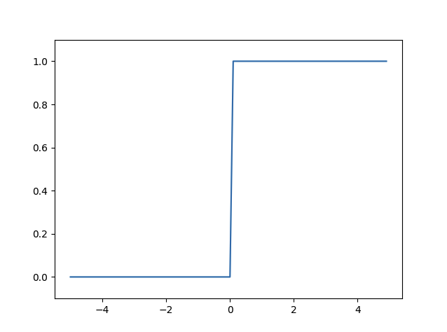
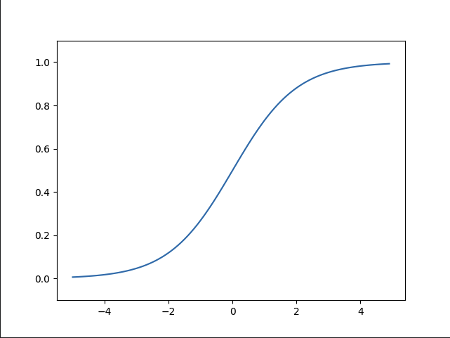
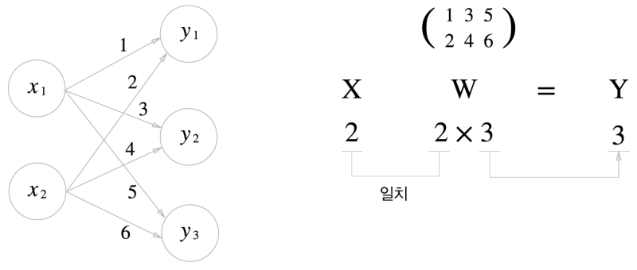
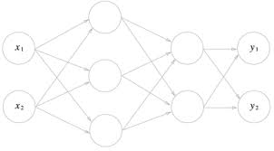
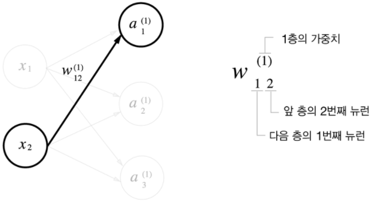
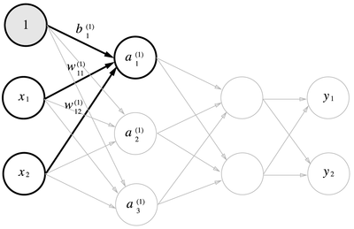

# Chapter03 신경망

Chapter02에서 배운 퍼셉트론으로는 이론상 컴퓨터가 수행하는 복잡한 처리도 표현할 수 있었다. 
나쁜 소식은 가중치를 설정하는 작업은 여전히 사람이 수동적으로 해야한다는 것이다. 신경망(Neural Network)은
이 나쁜 소식을 해결해준다. 가중치 매개변수의 적절한 값을 데이터로부터 자동으로 학습하는 능력이 이제부터
살펴볼 신경망의 아주 중요한 성질이다. 이번 장에서는 신경망의 개요를 설명하고 신경망이 입력 데이터가
무엇인지 식별하는 처리 과정을 자세히 알아보겠다. 

## 3.1 퍼셉트론에서 신경망으로
신경망은 퍼셉트론과 공통점이 많다. 퍼셉트론과 다른 점을 중심으로 신경망의 구조를 설명할 것

### 3.1.1 신경망의 예


- 은닉충의 뉴런은 입력층이나 출력층과 달리 사람 눈에는 보이지 않는다.
- 파이썬 배열의 인덱스가 0부터 시작하니 입력층에서 출력층 방향으로 0층부터 시작
- 그림에서는 입력층이 0층, 은닉층이 1층, 출력층이 2층이 된다.
> 신경망은 3층이지만 가중치를 갖는 층은 2개이므로 '2층 신경망'이라고 한다. 
> 하지만 문헌에 따라서는 '3층 신경망'이라고 하는 경우도 있다.
> 여기서는 가중치를 갖는 층의 개수를 기준으로 하겠다.


### 3.1.2 퍼셉트론 복습


- 기존의 퍼셉트론에서 편향을 명시한 퍼셉트론을 그림으로 나타낸 것
- 가중치가 b이고 입력이 1인 뉴런이 추가 된 것이다.
- 동작은 x1, x2, 1 이라는 3개의 신호가 뉴런에 입력되어, 각 신호에 가중치를 곱한 후, 다음 뉴런에 전달된다.
- 다음 뉴런에서는 이 신호들의 값을 더하여 0을 넘으면 1을 출력, 그렇지 않으면 0을 출력한다.
- 조건 분기의 동작(0을 넘으면 1을 출력, 그렇지 않으면 0을 출력)을 하나의 함수로 나타낸 `h(x)`
  - y = h(b + w1*x1 + w2*x2)
  - h(x) = 0 (x <= 0), 1 (x > 0)

### 3.1.3 활성화 함수의 등장
- 조금 전 h(x)라는 함수가 등장했는데, 이처럼 입력 신호의 총합을 출력 신호로 변환 하는 함수를 
일반적으로 `활성화 함수(activation function)`라고 한다.
- 3.1.2의 h(x)수식에서 입력 값을 a로 치환하면
  - a = b + w1*x1 + w2*x2
  - y = h(a)
- 가중치가 달린 입력 신호와 편향의 총합을 계산하고, 이를 a라고 한다. 그리고 a를 함수 h()에 넣어 
y를 출력하는 흐름이고 이를 그려보면 다음과 같다.


> 신경망의 동작을 더 명확히 드러내고자 할 때는 다음 그림처럼 활성화 처리 과정을 명시하기도 한다.
> 이 활성화 함수가 퍼셉트론에서 신경망으로 가기 위한 길잡이다.


## 3.2 활성화 함수
- 임계값을 경계로 출력이 바뀌는 함수를 `계단 함수 (Step Function)`이라고 한다.
- 여태껏 (퍼셉트론에서는) 활성화 함수로 계단 함수를 이용했다.
- 즉, 확성화 함수로 쓸 수 있는 여러 후보 중 퍼셉트론은 계단 함수를 채용 한 것.
- `이러한 활성화 함수를 계단 함수에서 다른 함수로 변경 하는 것이 신경망으로 나아가는 방법이다.`

### 3.2.1 시그모이드 함수
- 다음은 신경망에서 자주 이용하는 활성화 함수인 `시그모이드 함수(sigmoid function)`를 나타낸 식이다.
- 식 h(x) = 1 / 1 + exp(-x), 여기서 exp(-x) = e ^ -x 이다.
- 신경망에서는 활성화 함수로 시그모이드 함수를 이용하여 신호를 변환하고 변환된 신호를 다음 뉴런에 전달
- `사실 앞 장에서 본 퍼셉트론과 신경망의 주된 차이는 이 활성화 함수 뿐이다.`
- 그 외에 뉴런이 여러 층으로 이어지는 구조와 신호를 전달하는 방법은 기본적으로 앞에서 살펴본 퍼셉트론과 비슷

### 3.2.1 계단 함수 구현하기
```python
import numpy as np

def step_function(x):
    return np.array(x > 0, dtype=int)

x = np.array([-1.0, 2.0, 3.0, 4.0, 5.0, 6.0])
y = step_function(x)
print(y)
```
```
결과 출력 :

[0 1 1 1 1 1]
```
- numpy를 통해 배열을 생성했다.
- 이떄 x > 0 의 결과는 bool 배열이므로 dtype=int 를 통해 자료형을 변환하였음

### 3.2.2 계단 함수의 그래프
```python
import numpy as np
import matplotlib.pylab as plt

def step_function(x):
    return np.array(x > 0, dtype=int)

x_graph = np.arange(-5.0, 5.0, 0.1)
y = step_function(x_graph)
plt.plot(x_graph,y)
plt.ylim(-0.1, 1.1) # y축 범위 지정
plt.show()
```
- matplotlib 라이브러리 사용
- np.aranage를 통해 -5.0 ~ 5.0 전까지 0.1 간격의 넘파이 배열 생성
- step_function()은 인수로 받은 넘파이 배열의 원소 각각을 인수로 계단 함수 실행해, 
그 결과를 다시 배열로 만들어 돌려준다.
- 이 x,y 배열을 그래프로 그린(plot) 결과

  


### 3.2.4 시그모이드 함수 구현하기
```python
import numpy as np
import matplotlib.pylab as plt
def sigmoid(x):
    return 1 / (1 + np.exp(-x))

x = np.array([-1.0, 1.0, 2.0])
print(sigmoid(x))

x_graph = np.arange(-5.0, 5.0, 0.1)
y = sigmoid(x_graph)
plt.plot(x_graph,y)
plt.ylim(-0.1, 1.1) # y축 범위 지정
plt.show()
```
- 이 함수가 넘파이 배열도 훌륭히 처리해줄 수 있는 비밀은 넘파이의 브로드캐스트 때문
- 브로드캐스트 기능이란 넘파이 배열과 스칼라값의 연산을 넘파이 배열의 원소 각각과 스칼라값의 연산으로
바꿔 수행하는 것
- 그래프 결과

  

### 3.2.5 시그모이드 함수와 계단 함수 비교
- 공통점
  - 입력이 작을 떄의 출력은 0에 가깝고(혹은 0이고), 입력이 커지면 출력이 1에 가까워진다(혹은 1이다).
  - 즉, 입력이 중요하면 큰 값을 출력하고 중요하지 않으면 작은 값을 출력
  - 범위가 0 ~ 1 이다.
  - `비선형 함수이다.`
- 차이점
  - `매끄러움의 차이`
  - 시그모이드는 연속 함수, 계단 함수는 불연속 함수
  - 계단 함수는 0과 1 중 하나의 값만 return, 반면 시그모이드는 0~1 사이 연속적인 실수 return
  - `이러한 시그모이드 함수의 연속성이 신경망 학습에서 아주 중요한 역할을 하게 된다.`

### 3.2.6 비선형 함수
활성화 함수를 설명할 때 비선형 함수와 선형 함수라는 용어가 자주 등장한다. 함수란 어떤 값을 입력하면
그에 따른 값을 돌려주는 '변환기'역할인데, 이 변환기에 무언가 입력했을 때 출력이 입력의 상수배만큼
변하는 함수를 `선형 함수`라고 한다. 수식으로는 f(x) = ax + b 와 같은 것이고 선형 함수는 곧은
1개의 직선이 된다. 한편, `비선형 함수`는 문자 그대로 '선형이 아닌' 함수이다. 즉, 직선 1개로는
그릴 수 없는 함수를 의미한다.

- 신경망에서는 활성화 함수로 비선형 함수를 사용해야 한다.
- 선형 함수를 사용해서는 신경망의 층을 깊게 하는 의미가 없어지기 때문이다.
- 예를 들어 h(x) = cx를 활성화 함수로 사용한 3층 네트워크의 경우 y(x) = h(h(h(x))) = c*c*c*x
로 나타낼 수 있고, 즉 y(x) = ax와 똑같은 식이 된다.
- 이러한 예처럼 선형 함수를 이용해서 여러 층으로 구성하는 이점을 살릴 수 없다.

### 3.2.7 ReLU 함수
지금까지 활성화 함수로서 계단 함수와 시그모이드 함수를 소개했지만 최근에는 ReLU(Rectified Linear Unit, 렐루)
함수를 주로 이용한다.

```python
def relu(x):
    return np.maximum(0, x)
```
> numpy의 maximum 함수를 사용했다.

이러한 형태로 사용되며 식은 다음과 같다.
```
h(x) = x (x >  0), 
       0 (x <= 0)
```
후반부에는 주로 ReLU 함수를 사용한다.


## 3.3 다차원 배열의 계산

> numpy라이브러리를 활용하여 다차원 배열 계산하기

## 3.3.1 다차원 배열
```python
import numpy as np

A = np.array([1,2,3])
print(A)
print(np.ndim(A))
print(A.shape)
print("----------")
B = np.array([[1,2,3],[4,5,6]])
print(B)
print(np.ndim(B))
print(B.shape)
```
```
결과 

[1 2 3]
1
(3,)
----------
[[1 2 3]
 [4 5 6]]
2
(2, 3)
```
- np.array를 통해 n차원 배열 생성 가능
- np.ndim()을 통해 해당 배열의 차원을 알 수 있다.
- shape이라는 인스턴스 변수를 통해 배열의 형상을 알 수 있다.

### 3.3.2 행렬의 곱
```python
import numpy as np

A = np.array([[1,2],[3,4]])
B = np.array([[5,6],[7,8]])
C = np.dot(A,B)
print(C)

D = np.array([3,4])
print(np.dot(A,D))
```
```
결과

[[19 22]
 [43 50]]
[11 25]
```
- np.dot()을 통해 행렬의 곱을 구할 수 있다.
- 이때 A의 행의 수 와 B의 열의 수가 동일하지 않으면 `오류 발생`
- 다른 차원의 배열끼리 곱할 때도 대응하는 차원의 원소 수를 일치시켜야 한다.

### 3.3.3 신경망에서의 행렬 곱



- 입력 벡터 x = [1,2] 일때 y구하기
```python
import numpy as np

X = np.array([1,2])
W = np.array([[1,3,5],[2,4,6]])
Y = np.dot(X,W)
print(Y)
```
> 이처럼 numpy를 이용하여 간단한 신경망도 손쉽게 구할 수 있다. 이때 W의 행의 개수는 X의 원소 개수와
> 같아야 하고 W의 열의 개수는 Y의 원소의 개수와 같다.


## 3.4 3층 신경망 구현하기



- 3층 신경망에서 수행되는 입력부터 출력까지의 `순방향 처리`를 구현 해보기
- 넘파이 배열을 이용하여 구한다.
- 입력층(0층) : 2개의 노드, 은닉층(1층) : 3개의 노드, 은닉층(2층) : 2개의 노드, 출력층(3층) : 2개의 노드

### 3.4.1 표기법
이번 절에서 신경망에서의 처리를 설명하기 위하여 W12(1) 과 같은 표현을 쓴다. 이번 절에서의 핵심은 신경망에서의
계산을 행렬 계산으로 정리할 수 있다는 것이니 세세한 표기 규칙은 잊어버려도 된다. <br>
Wij(k) 일때, i는 다음 층의 뉴런을 나타내는 것이고 j는 앞 층의 뉴런을 나타내는 것이다. k는 해당 층의 가중치를 나타낸다.
가중치는 총 층의 개수 - 1 이다. 예를 들어 위에서 뉴런으로 구성된 층이 총 0~3 층 이렇게 4개의 층이 존재하며 이 사이에 가중치
들의 층은 총 3개가 존재할 수 있으며 이를 1~3 층이라고 표현한다.



### 3.4.2 각 층의 신호 전달 구현하기

- 1층의 첫 번째 뉴런으로 가는 신호

  
  
  - 1은 편향을 뜻하는 뉴런이다.
  - a1(1) = x1*w11(1) + x2*w12(1) + b1(1)
  - 여기서 행렬의 곱을 이용하여 아래와 같이 간소화 할 수 있다.
  - A(1) = XW(1) + B(1)
  - A(1) = [ a1(1) a2(1) a3(1) ]
  - X    = [ x1 x2 ]
  - W(1) = [ w11 ]
  -        [     ]
  
  $$1 + 1 = 2$$ 


