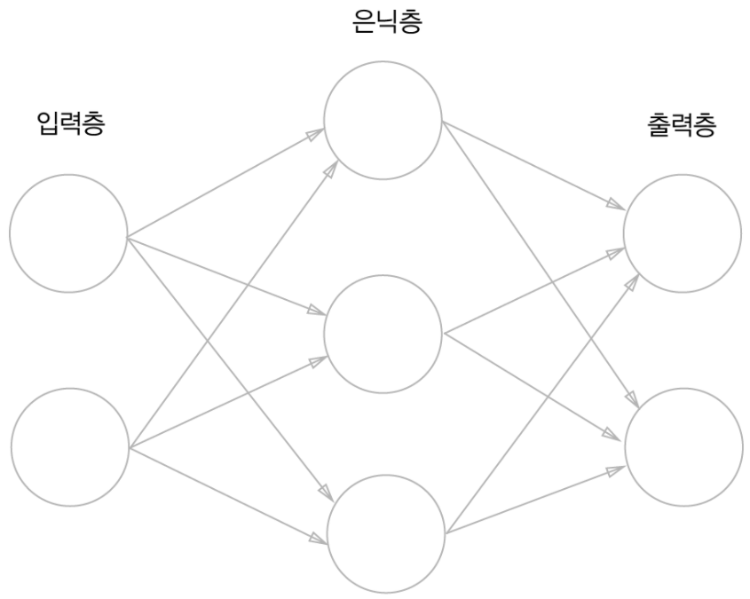
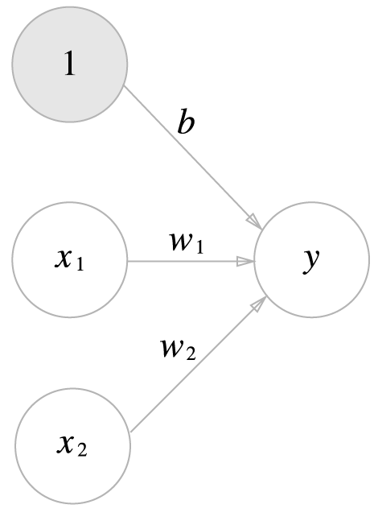
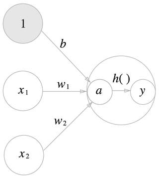

# Chapter03 신경망

Chapter02에서 배운 퍼셉트론으로는 이론상 컴퓨터가 수행하는 복잡한 처리도 표현할 수 있었다. 
나쁜 소식은 가중치를 설정하는 작업은 여전히 사람이 수동적으로 해야한다는 것이다. 신경망(Neural Network)은
이 나쁜 소식을 해결해준다. 가중치 매개변수의 적절한 값을 데이터로부터 자동으로 학습하는 능력이 이제부터
살펴볼 신경망의 아주 중요한 성질이다. 이번 장에서는 신경망의 개요를 설명하고 신경망이 입력 데이터가
무엇인지 식별하는 처리 과정을 자세히 알아보겠다. 

## 3.1 퍼셉트론에서 신경망으로
신경망은 퍼셉트론과 공통점이 많다. 퍼셉트론과 다른 점을 중심으로 신경망의 구조를 설명할 것

### 3.1.1 신경망의 예

- 은닉충의 뉴런은 입력층이나 출력층과 달리 사람 눈에는 보이지 않는다.
- 파이썬 배열의 인덱스가 0부터 시작하니 입력층에서 출력층 방향으로 0층부터 시작
- 그림에서는 입력층이 0층, 은닉층이 1층, 출력층이 2층이 된다.
> 신경망은 3층이지만 가중치를 갖는 층은 2개이므로 '2층 신경망'이라고 한다. 
> 하지만 문헌에 따라서는 '3층 신경망'이라고 하는 경우도 있다.
> 여기서는 가중치를 갖는 층의 개수를 기준으로 하겠다.

### 3.1.2 퍼셉트론 복습

- 기존의 퍼셉트론에서 편향을 명시한 퍼셉트론을 그림으로 나타낸 것
- 가중치가 b이고 입력이 1인 뉴런이 추가 된 것이다.
- 동작은 x1, x2, 1 이라는 3개의 신호가 뉴런에 입력되어, 각 신호에 가중치를 곱한 후, 다음 뉴런에 전달된다.
- 다음 뉴런에서는 이 신호들의 값을 더하여 0을 넘으면 1을 출력, 그렇지 않으면 0을 출력한다.
- 조건 분기의 동작(0을 넘으면 1을 출력, 그렇지 않으면 0을 출력)을 하나의 함수로 나타낸 `h(x)`
  - y = h(b + w1*x1 + w2*x2)
  - h(x) = 0 (x <= 0), 1 (x > 0)

### 3.1.3 활성화 함수의 등장
- 조금 전 h(x)라는 함수가 등장했는데, 이처럼 입력 신호의 총합을 출력 신호로 변환 하는 함수를 
일반적으로 `활성화 함수(activation function)`라고 한다.
- 3.1.2의 h(x)수식에서 입력 값을 a로 치환하면
  - a = b + w1*x1 + w2*x2
  - y = h(a)
- 가중치가 달린 입력 신호와 편향의 총합을 계산하고, 이를 a라고 한다. 그리고 a를 함수 h()에 넣어 
y를 출력하는 흐름이고 이를 그려보면 다음과 같다.

> 신경망의 동작을 더 명확히 드러내고자 할 때는 다음 그림처럼 활성화 처리 과정을 명시하기도 한다.
> 이 활성화 함수가 퍼셉트론에서 신경망으로 가기 위한 길잡이다.

## 3.2 활성화 함수

