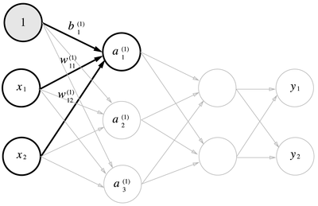
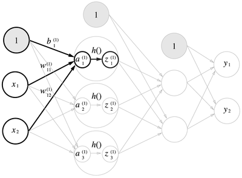
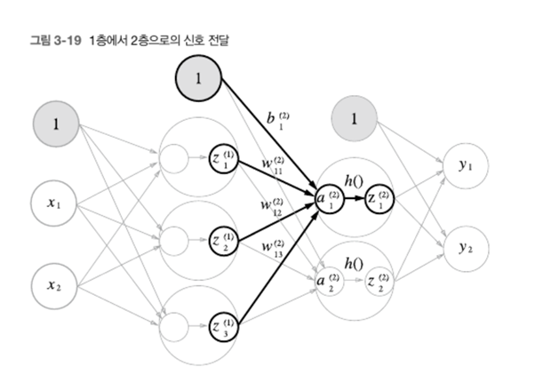
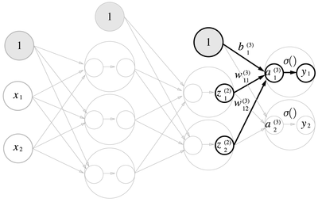
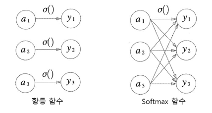
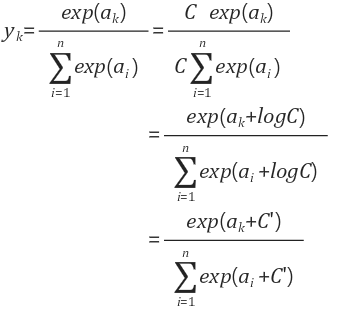
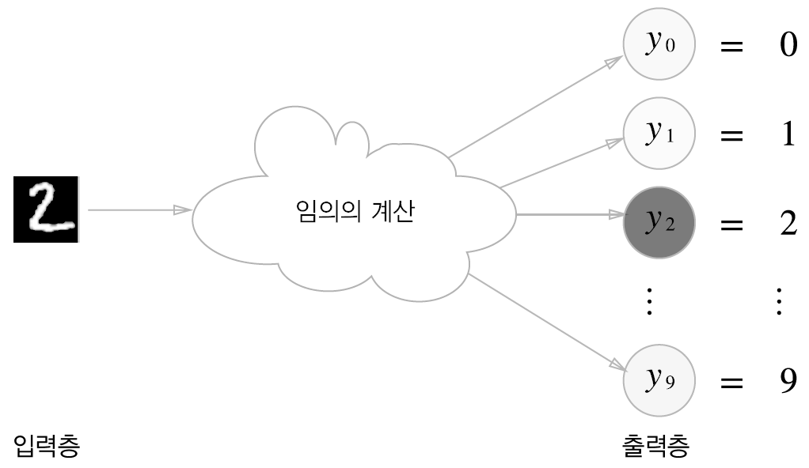
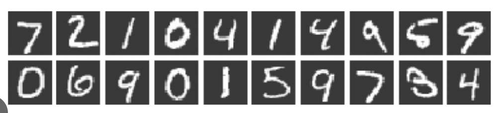

# Chapter03 신경망

Chapter02에서 배운 퍼셉트론으로는 이론상 컴퓨터가 수행하는 복잡한 처리도 표현할 수 있었다.
나쁜 소식은 가중치를 설정하는 작업은 여전히 사람이 수동적으로 해야한다는 것이다. 신경망(Neural Network)은
이 나쁜 소식을 해결해준다. 가중치 매개변수의 적절한 값을 데이터로부터 자동으로 학습하는 능력이 이제부터
살펴볼 신경망의 아주 중요한 성질이다. 이번 장에서는 신경망의 개요를 설명하고 신경망이 입력 데이터가
무엇인지 식별하는 처리 과정을 자세히 알아보겠다.

## 3.1 퍼셉트론에서 신경망으로
신경망은 퍼셉트론과 공통점이 많다. 퍼셉트론과 다른 점을 중심으로 신경망의 구조를 설명할 것

### 3.1.1 신경망의 예


- 은닉충의 뉴런은 입력층이나 출력층과 달리 사람 눈에는 보이지 않는다.
- 파이썬 배열의 인덱스가 0부터 시작하니 입력층에서 출력층 방향으로 0층부터 시작
- 그림에서는 입력층이 0층, 은닉층이 1층, 출력층이 2층이 된다.
> 신경망은 3층이지만 가중치를 갖는 층은 2개이므로 '2층 신경망'이라고 한다.
> 하지만 문헌에 따라서는 '3층 신경망'이라고 하는 경우도 있다.
> 여기서는 가중치를 갖는 층의 개수를 기준으로 하겠다.


### 3.1.2 퍼셉트론 복습


- 기존의 퍼셉트론에서 편향을 명시한 퍼셉트론을 그림으로 나타낸 것
- 가중치가 b이고 입력이 1인 뉴런이 추가 된 것이다.
- 동작은 x1, x2, 1 이라는 3개의 신호가 뉴런에 입력되어, 각 신호에 가중치를 곱한 후, 다음 뉴런에 전달된다.
- 다음 뉴런에서는 이 신호들의 값을 더하여 0을 넘으면 1을 출력, 그렇지 않으면 0을 출력한다.
- 조건 분기의 동작(0을 넘으면 1을 출력, 그렇지 않으면 0을 출력)을 하나의 함수로 나타낸 `h(x)`
  - y = h(b + w1*x1 + w2*x2)
  - h(x) = 0 (x <= 0), 1 (x > 0)

### 3.1.3 활성화 함수의 등장
- 조금 전 h(x)라는 함수가 등장했는데, 이처럼 입력 신호의 총합을 출력 신호로 변환 하는 함수를
  일반적으로 `활성화 함수(activation function)`라고 한다.
- 3.1.2의 h(x)수식에서 입력 값을 a로 치환하면
  - a = b + w1*x1 + w2*x2
  - y = h(a)
- 가중치가 달린 입력 신호와 편향의 총합을 계산하고, 이를 a라고 한다. 그리고 a를 함수 h()에 넣어
  y를 출력하는 흐름이고 이를 그려보면 다음과 같다.


> 신경망의 동작을 더 명확히 드러내고자 할 때는 다음 그림처럼 활성화 처리 과정을 명시하기도 한다.
> 이 활성화 함수가 퍼셉트론에서 신경망으로 가기 위한 길잡이다.


## 3.2 활성화 함수
- 임계값을 경계로 출력이 바뀌는 함수를 `계단 함수 (Step Function)`이라고 한다.
- 여태껏 (퍼셉트론에서는) 활성화 함수로 계단 함수를 이용했다.
- 즉, 활성화 함수로 쓸 수 있는 여러 후보 중 퍼셉트론은 계단 함수를 채용 한 것.
- `이러한 활성화 함수를 계단 함수에서 다른 함수로 변경 하는 것이 신경망으로 나아가는 방법이다.`

### 3.2.1 시그모이드 함수
- 다음은 신경망에서 자주 이용하는 활성화 함수인 `시그모이드 함수(sigmoid function)`를 나타낸 식이다.
- 식 h(x) = 1 / 1 + exp(-x), 여기서 exp(-x) = e ^ -x 이다.
- 신경망에서는 활성화 함수로 시그모이드 함수를 이용하여 신호를 변환하고 변환된 신호를 다음 뉴런에 전달
- `사실 앞 장에서 본 퍼셉트론과 신경망의 주된 차이는 이 활성화 함수 뿐이다.`
- 그 외에 뉴런이 여러 층으로 이어지는 구조와 신호를 전달하는 방법은 기본적으로 앞에서 살펴본 퍼셉트론과 비슷

### 3.2.1 계단 함수 구현하기
```python
import numpy as np

def step_function(x):
  return np.array(x > 0, dtype=int)

x = np.array([-1.0, 2.0, 3.0, 4.0, 5.0, 6.0])
y = step_function(x)
print(y)
```
```
결과 출력 :

[0 1 1 1 1 1]
```
- numpy를 통해 배열을 생성했다.
- 이떄 x > 0 의 결과는 bool 배열이므로 dtype=int 를 통해 자료형을 변환하였음

### 3.2.2 계단 함수의 그래프
```python
import numpy as np
import matplotlib.pylab as plt

def step_function(x):
  return np.array(x > 0, dtype=int)

x_graph = np.arange(-5.0, 5.0, 0.1)
y = step_function(x_graph)
plt.plot(x_graph,y)
plt.ylim(-0.1, 1.1) # y축 범위 지정
plt.show()
```
- matplotlib 라이브러리 사용
- np.aranage를 통해 -5.0 ~ 5.0 전까지 0.1 간격의 넘파이 배열 생성
- step_function()은 인수로 받은 넘파이 배열의 원소 각각을 인수로 계단 함수 실행해,
  그 결과를 다시 배열로 만들어 돌려준다.
- 이 x,y 배열을 그래프로 그린(plot) 결과

  


### 3.2.4 시그모이드 함수 구현하기
```python
import numpy as np
import matplotlib.pylab as plt
def sigmoid(x):
  return 1 / (1 + np.exp(-x))

x = np.array([-1.0, 1.0, 2.0])
print(sigmoid(x))

x_graph = np.arange(-5.0, 5.0, 0.1)
y = sigmoid(x_graph)
plt.plot(x_graph,y)
plt.ylim(-0.1, 1.1) # y축 범위 지정
plt.show()
```
- 이 함수가 넘파이 배열도 훌륭히 처리해줄 수 있는 비밀은 넘파이의 브로드캐스트 때문
- 브로드캐스트 기능이란 넘파이 배열과 스칼라값의 연산을 넘파이 배열의 원소 각각과 스칼라값의 연산으로
  바꿔 수행하는 것
- 그래프 결과

  

### 3.2.5 시그모이드 함수와 계단 함수 비교
- 공통점
  - 입력이 작을 떄의 출력은 0에 가깝고(혹은 0이고), 입력이 커지면 출력이 1에 가까워진다(혹은 1이다).
  - 즉, 입력이 중요하면 큰 값을 출력하고 중요하지 않으면 작은 값을 출력
  - 범위가 0 ~ 1 이다.
  - `비선형 함수이다.`
- 차이점
  - `매끄러움의 차이`
  - 시그모이드는 연속 함수, 계단 함수는 불연속 함수
  - 계단 함수는 0과 1 중 하나의 값만 return, 반면 시그모이드는 0~1 사이 연속적인 실수 return
  - `이러한 시그모이드 함수의 연속성이 신경망 학습에서 아주 중요한 역할을 하게 된다.`

### 3.2.6 비선형 함수
활성화 함수를 설명할 때 비선형 함수와 선형 함수라는 용어가 자주 등장한다. 함수란 어떤 값을 입력하면
그에 따른 값을 돌려주는 '변환기'역할인데, 이 변환기에 무언가 입력했을 때 출력이 입력의 상수배만큼
변하는 함수를 `선형 함수`라고 한다. 수식으로는 f(x) = ax + b 와 같은 것이고 선형 함수는 곧은
1개의 직선이 된다. 한편, `비선형 함수`는 문자 그대로 '선형이 아닌' 함수이다. 즉, 직선 1개로는
그릴 수 없는 함수를 의미한다.

- 신경망에서는 활성화 함수로 비선형 함수를 사용해야 한다.
- 선형 함수를 사용해서는 신경망의 층을 깊게 하는 의미가 없어지기 때문이다.
- 예를 들어 h(x) = cx를 활성화 함수로 사용한 3층 네트워크의 경우 y(x) = h(h(h(x))) = c*c*c*x
  로 나타낼 수 있고, 즉 y(x) = ax와 똑같은 식이 된다.
- 이러한 예처럼 선형 함수를 이용해서 여러 층으로 구성하는 이점을 살릴 수 없다.

### 3.2.7 ReLU 함수
지금까지 활성화 함수로서 계단 함수와 시그모이드 함수를 소개했지만 최근에는 ReLU(Rectified Linear Unit, 렐루)
함수를 주로 이용한다.

```python
def relu(x):
  return np.maximum(0, x)
```
> numpy의 maximum 함수를 사용했다.

이러한 형태로 사용되며 식은 다음과 같다.
```
h(x) = x (x >  0), 
       0 (x <= 0)
```
후반부에는 주로 ReLU 함수를 사용한다.


## 3.3 다차원 배열의 계산

> numpy라이브러리를 활용하여 다차원 배열 계산하기

## 3.3.1 다차원 배열
```python
import numpy as np

A = np.array([1,2,3])
print(A)
print(np.ndim(A))
print(A.shape)
print("----------")
B = np.array([[1,2,3],[4,5,6]])
print(B)
print(np.ndim(B))
print(B.shape)
```
```
결과 

[1 2 3]
1
(3,)
----------
[[1 2 3]
 [4 5 6]]
2
(2, 3)
```
- np.array를 통해 n차원 배열 생성 가능
- np.ndim()을 통해 해당 배열의 차원을 알 수 있다.
- shape이라는 인스턴스 변수를 통해 배열의 형상을 알 수 있다.

### 3.3.2 행렬의 곱
```python
import numpy as np

A = np.array([[1,2],[3,4]])
B = np.array([[5,6],[7,8]])
C = np.dot(A,B)
print(C)

D = np.array([3,4])
print(np.dot(A,D))
```
```
결과

[[19 22]
 [43 50]]
[11 25]
```
- np.dot()을 통해 행렬의 곱을 구할 수 있다.
- 이때 A의 행의 수 와 B의 열의 수가 동일하지 않으면 `오류 발생`
- 다른 차원의 배열끼리 곱할 때도 대응하는 차원의 원소 수를 일치시켜야 한다.

### 3.3.3 신경망에서의 행렬 곱


- 입력 벡터 x = [1,2] 일때 y구하기
```python
import numpy as np

X = np.array([1,2])
W = np.array([[1,3,5],[2,4,6]])
Y = np.dot(X,W)
print(Y)
```
> 이처럼 numpy를 이용하여 간단한 신경망도 손쉽게 구할 수 있다. 이때 W의 행의 개수는 X의 원소 개수와
> 같아야 하고 W의 열의 개수는 Y의 원소의 개수와 같다.


## 3.4 3층 신경망 구현하기


- 3층 신경망에서 수행되는 입력부터 출력까지의 `순방향 처리`를 구현 해보기
- 넘파이 배열을 이용하여 구한다.
- 입력층(0층) : 2개의 노드, 은닉층(1층) : 3개의 노드, 은닉층(2층) : 2개의 노드, 출력층(3층) : 2개의 노드

### 3.4.1 표기법
- 이번 절에서 신경망에서의 처리를 설명하기 위하여 W12(1) 과 같은 표현을 쓴다. 
- 이번 절에서의 핵심은 신경망에서의 계산을 행렬 계산으로 정리할 수 있다는 것이니 세세한 표기 규칙은 잊어버려도 된다.
- Wij(k) 일때, i는 다음 층의 뉴런을 나타내는 것이고 j는 앞 층의 뉴런을 나타내는 것이다. 
- k는 해당 층의 가중치를 나타낸다. 
- 가중치는 총 층의 개수 - 1 이다. 
- 예를 들어 위에서 뉴런으로 구성된 층이 총 0~3 층 이렇게 4개의 층이 존재하며 이 사이에
가중치들의 층은 총 3개가 존재할 수 있으며 이를 1~3 층이라고 표현한다.


### 3.4.2 각 층의 신호 전달 구현하기

- 1층의 첫 번째 뉴런으로 가는 신호

  

  - 1은 편향을 뜻하는 뉴런이다.
  - a1(1) = x1*w11(1) + x2*w12(1) + b1(1)
  - 여기서 행렬의 곱을 이용하여 아래와 같이 간소화 할 수 있다.
  - A(1) = XW(1) + B(1)
  - A(1) = [ a1(1) a2(1) a3(1) ]
  - B(1) = [ b1(1) b2(1) b3(1) ]
  - X = [ x1 x2 ]
  - W(1) = [ w11(1) w21(1) w31(1) ], [ w12(1) w22(1) w32(1) ]
  > 행렬 표기법 Aij 에서 i는 행, j는 열을 나타내지만 여기서 W표기에 대해서는 프로그래밍에 초점을
  > 맞추다 보니 행과 열을 반대로 나타낸 것 같다.<br> 예를 들어 W21 이면 행렬식 표기에서는 2행 1열 이라는 의미
  > 이지만 여기서는 1행의 2열에 위치하며 다음 층의 두번째 뉴런과 이전 층의 첫번째 뉴런과 이어지는 가중치라는
  > 의미이다.
  - numpy를 이용하여 구현하기(B1, X, W1은 적당한 값으로 설정)
  ```python
  import numpy as np
  
  B1 = np.array([0.1, 0.2, 0.3])
  X = np.array([0.5, 0.4])
  W1 = np.array([[0.1, 0.1, 0.1], [0.5, 0.1, 0.1]])
  
  A1 = np.dot(X,W1) + B1
  
  print(A1)
  ```
  ```
  출력 
  
  [0.35 0.29 0.39]
  ```
  - 1층의 활성화 함수에서의 처리

  

  ```python
  Z1 = sigmoid(A1)
  print(Z1)
  ```

- 1층에서 2층으로의 신호 전달

  

  - Z = [ z1 z2 z3 ]
  - W(2) = [ w11(2) w21(2) ] , [ w12(2) w22(2) ] , [ w13(2) w23(2) ]
  - B(2) = [ b1(2) b2(2) ]
  - A(2) = Z*W(2) + B(2) = [ a1(2) a2(2) ]
  - a1(2) = z1*w11(2) + z2*w12(2) + z3*w13(2)
  - a2(2) = z1*w21(2) + z2*w22(2) + z3*w23(2)
  - numpy로 구현하기 (임의의 값 설정, 활성화 함수는 시그모이드)

  ```python
  W2 = np.array([[0.2, 0.1], [0.5, 0.8], [0.4, 0.3]])
  B2 = np.array([0.1, 0.1])
  A2 = np.dot(Z1,W2) + B2
  
  print("A2 = ", A2)
  
  Z2 = sigmoid(A2)
  print("Z2 = ", Z2)
  ```
  ```
  출력
  
  A2 =  [0.74183466 0.79514347]
  Z2 =  [0.67739692 0.68893467]
  ```
  > 1층의 출력 Z1이 2층의 입력이 된다는 점을 제외하면 조금 전의 구현과 동일하다.

- 2층에서 출력층으로의 신호 전달

  
  
  > 활성화 함수만 제외하면 지금까지 구현과 거의 같다. 그러므로 skip


### 3.4.3 구현 정리

```python
import numpy as np
from sigmoid import sigmoid

def identity_fun(x):
    return x

def init_network():
    network = {}
    network['W1'] = np.array([[0.1, 0.1, 0.1], [0.5, 0.1, 0.1]])
    network['B1'] = np.array([0.1, 0.2, 0.3])
    network['W2'] = np.array([[0.2, 0.1], [0.5, 0.8], [0.4, 0.3]])
    network['B2'] = np.array([0.1, 0.1])
    network['W3'] = np.array([[0.1,0.2],[0.3,0.4]])
    network['B3'] = np.array([0.1,0.4])
    return network

def forward(network, X) :
    W1, W2, W3 = network['W1'], network['W2'], network['W3']
    B1, B2, B3 = network['B1'], network['B2'], network['B3']

    A1 = np.dot(X,W1) + B1
    Z1 = sigmoid(A1)
    A2 = np.dot(Z1,W2) + B2
    Z2 = sigmoid(A2)
    A3 = np.dot(Z2,W3) + B3
    y = identity_fun(A3)

    return y

network = init_network()
X = np.array([0.5, 0.4])
y = forward(network, X)
print(y)
```

- 출력층 활성화 함수로는 은닉층과 다르게 하기위해 입력값을 그대로 출력하는 identity_fun()을 정의
- init_network() 함수는 가중치와 편향을 초기화 하고 딕셔너리 형태로 return
- forward() 함수는 입력 신호를 출력으로 변환하는 순방향 처리 과정을 모두 구현하고 있다.


## 3.5 출력층 설계하기

- 신경망은 분류와 회귀 모두 이용할 수 있다.
- 다만 둘 중 어떤 문제냐에 따라 출력층에서 사용하는 활성화 함수가 달라진다.
- `일반적으로 회귀에는 항등 함수, 분류에는 소프트맥스 함수를 사용`

> 기계학습 문제는 분류(classification)와 회귀(regression)로 나뉜다.<br>
> 분류는 데이터가 어느 클래스(class)에 속하느냐는 문제이고 사진 속 인물의 성별을 분류하는 문제가 여기에
> 속한다. <br>
> 한편, 회귀는 입력 데이터에서 (연속적인) 수치를 예측하는 문제이고 사진 속 인물의 몸무게(57.4kg?)를
> 예측하는 문제가 회귀이다.


### 3.5.1 항등 함수와 소프트맥스 함수 구현하기

#### 항등 함수
- `항등 함수(identity function)`는 입력을 그대로 출력한다.
- 입력과 출력이 항상 같다는 뜻의 항등이다. 
- 그래서 출력층에서 항등 함수를 사용하면 입력 신호가 그대로 출력 신호가 된다.
- 입력을 그대로 출력해주면 되므로 구현은 생략

#### 소프트맥스 함수
- 분류에서는 `softmax function`(소프트맥스 함수)를 사용하며 식은 다음과 같다.

$$
y_k = \frac{\exp(a_k)}{\sum_{j=1}^{n} \exp(a_j)}
$$

- exp(x)는 e^x 을 뜻하는 지수 함수(exponential function)이다.
- 식에서 볼 수 있듯이 소프트맥스 함수의 모든 출력은 모든 입력 신호로부터 화살표를 받는다.



#### 소프트맥스 함수 구현

  ```python
  import numpy as np
  
  def softmax(a):
      exp_a = np.exp(a)
      sum_exp_a = np.sum(exp_a)
      y = exp_a / sum_exp_a
  
      return y
  ```

### 3.5.2 소프트맥스 함수 구현 시 주의점
- 위에서 구현한 소프트맥스 함수는 오버플로 문제를 야기한다.
- 왜냐하면 소프트맥스 함수는 지수 함수를 사용하기 때문이다.
- 이 문제를 해결하도록 소프트맥스 함수 구현을 개선해보자



- 다음 식의 전개 과정을 살펴보자
- 첫 번째 변형에서는 C라는 임의의 정수를 분자와 분모 양쪽에 곱했다. (양쪽에 같은 수를 곱했으니 같은 계산)
- 그다음으로 C를 지수 함수 exp() 안으로 옮겨 logC로 만들었다.
- 마지막으로 logC를 C'라는 새로운 기호로 바꿨다.
- `이 식이 말하고자 하는 것은 소프트맥스의 지수 함수를 계산할 때 어떤 정수를 더해도(혹은 빼도) 결과는 바뀌지
않는 다는 것`
- 여기서 C'에 어떤 값을 대입해도 상관없지만, 오버플로를 막을 목적으로 입력 신호 중 최댓값을 이용하는 것이
일반적이다.
- 개선 코드
  ```python
  import numpy as np
  
  def softmax(a):
      c = np.max(a)
      exp_a = np.exp(a - c)   # 오버플로 대책 
      sum_exp_a = np.sum(exp_a)
      y = exp_a / sum_exp_a
  
      return y
  ```


### 3.5.3 소프트맥스 함수의 특징
- softmax() 함수를 사용하여 신경망의 출력을 다음과 같이 계산할 수 있다.
  ```python
  a = np.array([0.3, 2.9, 4.0])
  y = softmax(a)
  print(y)
  ```
  ```
  결과 
  
  [0.01821127 0.24519181 0.73659691]
  ```
- 보는 바와 같이 소프트맥스 함수의 출력은 0 ~ 1.0 사이 실수이다.
- 또한 출력의 총합은 1이다.
- 이러한 성질 덕분에 소프트맥스 함수의 출력을 `확률`로 해석할 수 있다.
- 이러한 결과로부터 y[2]의 값, 즉 확률이 가장 높으므로 "답은 2번째 클래스다." 라고 할 수 있으며 혹은
"74%확률로 2번째 클래스, 25%확률로 1번째 클래스, 1%확률로 0번째 클래스다."와 같은 확률적인 결론도 낼 수 있다.
- `즉, 소프트맥스 함수를 이용함으로써 문제를 확률적(통계적)으로 대응할 수 있게 된다.`
- 여기서 주의 점으로, 소프트맥스 함수를 적용해도 각 원소의 대소 관계는 변하지 않는다.(y=exp(x)가 단조 증가 함수이기 때문) 그러므로 현업에서는 
지수 함수 계산에 드는 낭비를 줄이고자 출력층의 소프트맥스 함수는 생략하는 것이 일반적이다.

> 기계학습의 문제 풀이는 `학습과 추론(inference)`의 두 단계를 거쳐 이뤄진다.<br>
> 학습 단계에서 모델을 학습하고(직업 훈련을 받고), 추론 단계에서 앞서 학습한 모델로 미지의 데이터에
> 대해서 추론(분류)을 수행한다(현장에 나가 진짜 일을 한다.). <br>
> 방금 설명한 대로, 추론 단계에서는 출력층의 소프트맥스 함수를 생략하는 것이 일반적이지만 신경망 학습시에는
> 출력층에서 소프트맥스 함수를 사용한다.(4장 참고)


### 3.5.4 출력층의 뉴런 수 정하기



- 출력층의 뉴런 수는 풀려는 문제에 맞게 적절히 정해야 한다.
- 분류에서는 분류하고 싶은 클래스 수로 설정하는 것이 일반적
- 예를 들어 위의 그림과 같이 이미지를 숫자 0~9로 분류하는 문제라면 출력층의 뉴런을 10개로 설정
- 위의 그림에서도 출력층 뉴런은 위에서부터 차례대로 0~9에 대응하며, 뉴런의 회색 농도가 해당 뉴런의 출력 값의
크기를 의미한다.
- 이 예에서는 색이 가장 짙은 y2 뉴런이 가장 큰 값을 출력하는 것이다.
- 따라서 이 신경망이 성택한 클래스는 y2, 즉 입력 이미지를 숫자 2로 판단했음을 의미


## 3.6 손글씨 숫자 인식

- 여태껏 배운 신경망을 손글씨 숫자 인식 이라는 실전 예에 적용해보기
- 이미 학습된 매개변수를 사용하여 학습 과정은 생력하고, 추론 과정만 구현할 것
- 이러한 추론 과정을 신경망의 순전파(forward propagation)라고도 합니다.

> 기계학습과 마찬가지로 신경망도 두 단계를 거쳐 문제를 해결한다. <br>
> 먼저 훈련 데이터(학습 데이터)를 사용해 가중치 매개변수를 학습하고, <br>
> 앞서 학습한 매개변수를 사용하여 입력 데이터를 분류한다.


### 3.6.1 MNIST 데이터셋
- 이번 예제에서 사용하는 데이터셋은 MNIST라는 손글씨 숫자 이미지 집합이다.
- Mnist는 기계학습 분야에서 아주 유명한 데이터셋이며 간단한 실험부터 논문으로 
발표되는 연구까지 다양한 곳에서 이용되고 있다.
- MNIST 데이터셋은 0~9까지의 숫자 이미지로 구성되며 훈련 이미지가 60,000장, 시험 이미지가 10,000장
준비되어 있다.
- 일반적으로 이 훈련 이미지들을 사용하여 모델을 학습하고, 학습한 모델로 시험 이미지들을 얼마나
정확하게 분류하는지를 평가할 것.



- MNISt의 이미지 데이터는 28*28 크기의 회색조 이미지(1채널) 이며, 각 픽셀은 0~255까지의 값을 취한다.
- 각 이미지에는 또한 '7', '2', '1'과 같이 그 이미지가 실제 의미하는 숫자가 레이블로 붙어 있다.

#### mnist_show.py - 첫번째 훈련 이미지 표시하기
```python
# coding: utf-8
import sys, os
sys.path.append(os.pardir)  # 부모 디렉터리의 파일을 가져올 수 있도록 설정
import numpy as np
from dataset.mnist import load_mnist
from PIL import Image


def img_show(img):
    pil_img = Image.fromarray(np.uint8(img))
    pil_img.show()

(x_train, t_train), (x_test, t_test) = load_mnist(flatten=True, normalize=False)

img = x_train[0]
label = t_train[0]
print(label)  # 5

print(img.shape)  # (784,)
img = img.reshape(28, 28)  # 형상을 원래 이미지의 크기로 변형
print(img.shape)  # (28, 28)

img_show(img)
```
- dataset/mnist.py파일에서  MNIST 데이터셋을 내려받아 이미지를 넘파이 배열로 변환해주는 파이썬 스크립트를 제공해줬다.
- 최초 실행 시에는 인터넷이 연결된 상태여야 하며 두 번째부터는 로컬에 저장된 파일(pickle 파일)을 읽기 때문에
순식간에 끝난다.
- load_mnist() 함수는 읽은 MNIST 데이터를 "(훈련 이미지, 훈련 레이블), (시험 이미지, 시험 레이블)"
형식으로 반환한다. 인수로는 normalize, flatten, one_hot_label 세 가지를 설정할 수 있으며 모두 bool 값이다.
- 첫 번째 인수인 normalize는 입력 이미지의 픽셀 값을 0.0 ~ 1.0 사이의 값으로 정규화할지를 정한다. False로
설정하면 입력 이미지의 픽셀은 원래 값 그대로 0 ~ 255 사이의 값을 유지한다.
- 두 번째 인수인 flatten은 입력 이미지를 평탄하게, 즉 1차원 배열로 만들지를 정한다. False로 설정하면 입력
이미지를 1*28*28의 3차원 배열로, True로 설정하면 784개의 원소로 이뤄진 1차원 배열로 저장한다.
- 세 번째 인수인 one_hot_label은 레이블을 one-hot encoding 형태로 저장할지를 정한다.
  - one-hot encoding이란, 예를 들어 [0,0,1,0,0,0,0,0] 처럼 정답을 뜻하는 원소만 1이고(hot하고) 
  나머지는 모두 0인 배열이다.
  - one_hot_label이 False이면 '7'이나 '2'와 같이 숫자 형태의 레이블을 저장하고, True일 때는 레이블을
  원-핫 인코딩하여 저장한다.

> 파이썬에는 pickle(피클)이라는 편리한 기능이 있다. 이는 프로그램 실행 중에 특정 객체를 파일로 저장하는 기능이다. <br>
> 저장해둔 pickle 파일을 로드하면 실행 당시의 객체를 즉시 복원할 수 있다.<br>
> MNIST 데이터셋을 읽는 load_mnis()함수에서도 2번째 이후의 읽기 시 pickle를 이용한다.

- 이미지 표시에는 PIL(Python Image Library) 모듈을 사용한다.
- 주의할 점은, flatten=True로 설정하여 1차원 넘파이 배열로 저장되어 있기 때문에 이미지를 표시할 떄는 원래
형상인 28*28 크기로 다시 변형해야 한다.
- reshape() 메서드에 원하는 형상을 인수로 지정하면 넘파이 배열의 형상을 바꿀 수 있다.
- 또한, 넘파이로 저장된 이미지 데이터를 PIL용 데이터 객체로 변환해야 하는데 이 변환은 Image.fromarray()
가 수행한다.


### 3.6.2 신경망의 추론 처리

- 이 MNIST 데이터셋으로 추론을 수행하는 신경망을 구현해보자
- 이 신경망은 입력층 뉴런이 784개, 출력층 뉴런이 10개이다.
- 입력층 뉴런이 784개인 이유는 이미지 크기가 28*28=784 이기 떄문이고, 출력층 뉴런이 10개인 이유는 문제가
0 ~ 9 까지의 숫자를 구분하는 문제이기 때문이다.
- 은닉층은 총 두 개로, 첫 번째 은닉충에는 50개의 뉴런, 두 번째 은닉충에는 100개의 뉴런을 배치할 것이다.
- 여기서 50과 100은 임의로 정한 값이다.
- code - neuralnet_mnist.py
```python
# coding: utf-8
import sys, os
sys.path.append(os.pardir)  # 부모 디렉터리의 파일을 가져올 수 있도록 설정
import numpy as np
import pickle
from dataset.mnist import load_mnist
from common.functions import sigmoid, softmax


def get_data():
    (x_train, t_train), (x_test, t_test) = load_mnist(normalize=True, flatten=True, one_hot_label=False)
    return x_test, t_test


def init_network():
    with open("sample_weight.pkl", 'rb') as f:
        network = pickle.load(f)
    return network


def predict(network, x):
    W1, W2, W3 = network['W1'], network['W2'], network['W3']
    b1, b2, b3 = network['b1'], network['b2'], network['b3']

    a1 = np.dot(x, W1) + b1
    z1 = sigmoid(a1)
    a2 = np.dot(z1, W2) + b2
    z2 = sigmoid(a2)
    a3 = np.dot(z2, W3) + b3
    y = softmax(a3)

    return y


x, t = get_data()
network = init_network()
accuracy_cnt = 0
for i in range(len(x)):
    y = predict(network, x[i])
    p= np.argmax(y) # 확률이 가장 높은 원소의 인덱스를 얻는다.
    if p == t[i]:
        accuracy_cnt += 1

print("Accuracy:" + str(float(accuracy_cnt) / len(x)))
```
- init_network에서는 pickle 파일인 sample_weight.pkl에 저장된 '학습된 가중치 매개변수'를 읽으며 이
파일에는 가중치와 편향 매개변수가 딕셔너리 변수로 저장되어 있다.
- 나머지 두 함수는 지금까지 보아온 구현과 거의 같으니 설명은 생략
- 이 세 함수를 사용해 신경망에 의한 추론을 수행해보고, 정확도(accuracy)도 평가해보자
- 가장 먼저 MNIST 데이터셋을 얻고 네트워크를 생성한다. 이때 학습된 신경망을 이용하므로 test 데이터셋만 가져온다.
- 이어서 for문을 돌며 저장된 이미지 데이터를 1장씩 꺼내 predict함수로 예측하고 이 중 가장 확률이 높은 원소의
인덱스를 얻어 p에 넣는다.
- 이후 p와 정답 레이블을 비교하여 맞으면 accuracy_cnt를 ++한다.
- 그리고 전체 이미지의 개수로 나누어 accuracy 확률을 구한다.
- 이 코드를 실행하면 "Accuracy:0.9352" 라는 결과가 출력되며 이는 올바르게 분류한 비율이 93.52%라는 것을 의미한다.
- 다음 장부터는 신경망 구조와 학습 방법을 궁리하여 이 정확도를 더 높여갈 것이다.
- 마지막에는 99%까지 도달할 예정 !!
- 또한, 이 예제에서는 load_mnist 함수의 인수인 normalize를 True로 설정하였는데 이는 0~255 범위인 
각 픽셀을 단순히 255로 나누어 0.0~1.0 범위로 변환한다.
- 이처럼 데이터를 특정 범위로 변환하는 처리를 정규화(normalization)라 하고, 신경망의 입력 데이터에 특정 변환을
가하는 것을 전처리(pre-processing)라고 한다.
- 여기에서는 입력 이미지 데이터에 대한 전처리 작업으로 정규화를 수행한 셈이다.

> 현업에서도 신경망(딥러닝)에 전처리를 활발히 사용한다. 여기서는 단순히 각 픽셀의 값을 255로 나누는 정규화를 수행했지만,
> 현업에서는 데이터 전체의 분포를 고려해 전처리하는 경우가 많다. <br>
> 예를 들어 데이터 전체 평균과 표준편차를 이용하여 데이터들이 0을 중심으로 분포하도록 이동하거나 데이터의 확산
> 범위를 제한하는 정규화를 수행시킨다. 또한 데이터 백색화(whitening)라는 전체 데이터를 균일하게 분포시키는 방법도 있다.


### 3.6.3 배치 처리


