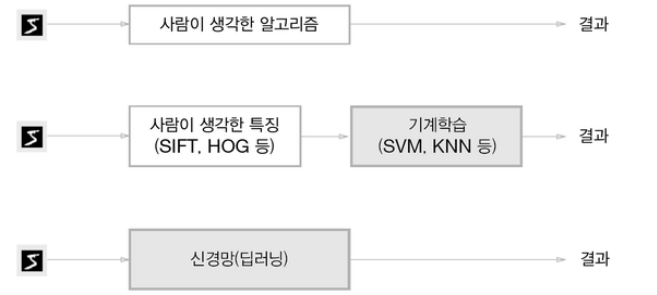
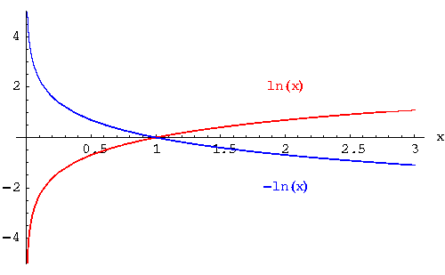

# Chapter04 신경망 학습

- 이번 장의 주제는 신경망 학습이다.
- 여기서 학습이란 훈련 데이터로부터 가중치 매개변수의 최적값을 자동으로 획득하는 것을 뜻한다.
- 이번 장에서는 신경망이 학습할 수 있도록 해주는 지표인 손실 함수를 소개한다.
- 이 손실 함수의 결괏값을 가장 작게 만드는 가중치 매개변수를 찾는 것이 학습 목표이다.
- 이번 장에서는 손실 함수의 값을 가급적 작게 만드는 기법으로, 함수의 기울기를 활용하는 경사법을 소개한다.

## 4.1 데이터에서 학습한다 !
- 신경망의 특징은 데이터를 보고 학습할 수 있다는 점이다.
- 데이터에서 학습한다는 것은 가중치 매개변수의 값을 데이터를 보고 자동으로 결정한다는 뜻이다.
- 이번 장에서는 신경망 학습(데이터로부터 매개변수의 값을 정하는 방법)에 대하여 설명하고 파이썬으로 
MNIST 데이터셋의 손글씨 숫자를 학습하는 코드를 구현한다.

### 4.1.1 데이터 주도 학습
- 기계학습은 데이터가 생명이다. 데이터에서 답을 찾고 데이터에서 패턴을 발견하고 데이터로 이야기를 만드는 것이
기계학습이다.
- 기계학습에서는 사람의 개입을 최소화하고 수집한 데이터로부터 패턴을 찾으려고 시도해야 한다.
- 기계학습의 두 가지 접근법이 있는데 하나는 사람이 설계를 하여 기계가 학습하는 것이고 나머지 하나는 오직 기계가
처음부터 끝까지 데이터의 특징을 생각해내어 학습한다는 것이다.



- 이처럼 신경망(딥러닝)은 이미지를 "있는 그대로" 학습한다.
- 두 번째 접근 방식에서는 특징을 사람이 설계했지만, 신경망은 이미지에 포함된 중요한 특징까지도 "기계"가 스스로
학습할 것이다.
- 이러한 이유 때문에 딥러닝을 end-to-end machine learning이라고도 한다. 여기서 end-to-end란 '처음부터
끝까지'라는 의미로, 데이터(입력)에서 목표한 결과(출력)를 사람의 개입 없이 얻는다는 뜻을 담고 있다.
- 신경망의 이점은 모든 문제를 같은 맥락에서 풀 수 있다는 점이다.
- 예를 들어 '5'를 인식하는 문제든, '개'를 인식하는 문제든 세부사항과 관계없이 신경망은 주어진 데이터를 온전히 
학습하여 주어진 문제의 패턴을 발견하려고 시도한다.


### 4.1.2 훈련 데이터와 시험 데이터 
- 기계학습 문제는 데이터를 훈련 데이터(training data)와 시험 데이터(test data)로 나눠 학습과 실험을
수행하는 것이 일반적이다.
- 우선 훈련 데이터만 사용하여 학습하면서 최적의 매개변수를 찾는다. 
- 그런 다음 시험 데이터를 사용하여 앞서 훈련한 모델의 실력을 평가하는 것이다.
- 훈련 데이터와 시험 데이터를 나누는 이유는 우리는 `범용적으로 사용할 수 있는 모델을 원하기 때문이다.`
- 범용 능력을 제대로 평가하기 위해 훈련 데이터와 시험 데이터를 분리하는데, 여기서 `범용 능력이란 아직 보지 못한 데이터
  (훈련 데이터에 포함되지 않는 데이터)로도 문제를 올바르게 풀어내는 능력이다.`
- 즉 기계학습의 최종 목표는 이 범용 능력을 획득하는 것이다.
- 예를 들어, '특정인의 특정 글자'가 아닌 '임의의 사람의 임의의 글자'를 판단하는 모델을 개발해야한다.
- 만약 수중에 있는 훈련 데이터만 잘 판별한다면 그 데이터에 포함된 사람의 글씨체만 학습했을 가능성이 크다.
- 따라서 하나의 데이터셋으로만 학습과 평가를 수행하면 올바른 평가가 될 수 없다. 
- 참고로 한 데이터셋에만 지나치게 최적화된 상태를 `오버피팅(overfitting)`이라고 한다. 오버피팅을 피하는 것이
기계학습의 중요한 과제이기도 하다.


## 4.2 손실 함수
- 신경망 학습에서는 현재의 상태를 '하나의 지표'로 표현한다.
- 그 지표를 가장 좋게 만들어주는 가중치 매개변수의 값을 탐색하는 것이 목표이다.
- 신경망 학습에서 사용하는 지표는 `손실 함수 (loss fuction)`이다.
- 이 손실 함수는 일반적으로 오차제곱합과 교차 엔트로피 오차를 사용한다.
- 이 손실 함수는 '얼마나 나쁘냐'를 기준으로 하므로 이 손실 함수의 값을 0에 가까운 값으로 학습시키는 것이 목표이다.

### 4.2.1 오차제곱합 (sum of squares for error, SSE)
- 가장 많이 쓰이는 손실 함수는 오차제곱합이며 수식은 다음과 같다.
  - yi는 신경망의 출력 (신경망이 추정한 값)
  - ti는 정답 레이블
  - K는 데이터의 차원 수
  - 예를 들어 손글씨 데이터 라면 0~9까지 10개의 차원이므로 k=10 이다.
  
$$
E = \\frac{1}{2} \\sum_{i}(y_{i} - t_{i})^2
$$

```python
y = [0.1, 0.05, 0.6, 0.0, 0.05, 0.1, 0.0, 0.1, 0.0, 0.0]
t = [0, 0, 1, 0, 0, 0, 0, 0, 0, 0]
```

- 다음과 같이 주어졌을 때, y는 소프트맥스 함수를 통해 출력된 값이다.
- t에서 정답을 가리키는 위치의 원소는 1로, 그 외에는 0으로 표기하는 원-핫 인코딩 방식을 사용하여 정답이 '2'임을 나타낸다.

```python
def sum_squares_error(y,t):
    return 0.5 * np.sum((y-t)**2)
```

- 여기서 인수 y와 t는 넘파이 배열이다.
- 오차제곱합을 파이썬 함수로 표현한 것임.

```python
import numpy as np

def sum_squares_error(y,t):
    return 0.5 * np.sum((y-t)**2)

y2 = [0.1, 0.05, 0.6, 0.0, 0.05, 0.1, 0.0, 0.1, 0.0, 0.0]
y7 = [0.1, 0.05, 0.1, 0.0, 0.05, 0.1, 0.0, 0.6, 0.0, 0.0]
t = [0, 0, 1, 0, 0, 0, 0, 0, 0, 0]

print(sum_squares_error(np.array(y2), np.array(t)))
print(sum_squares_error(np.array(y7), np.array(t)))
```
```
결과

0.09750000000000003
0.5975
```
- 이처럼 원-핫 인코딩 방식으로 정답이 '2'인 레이블이 주어졌을 때, '2'로 예측한 값과 '7'로 예측한 결과 값을 비교해보자.
- '2'라고 정확히 예측한 결과 값이 '7'이라고 잘못 예측한 결과값보다 현저히 작은 것을 볼 수 있다.
- 즉 , 오차제곱합 기준으로는 y2의 추정 결과가 정답에 더 가까울 것으로 판단할 수 있다.


### 4.2.2 교차 엔트로피 오차 (cross entropy error, CEE)

- 또 다른 손실함수로서 교차 엔트로피 오차도 자주 이용하고 수식은 다음과 같다.
  - log는 밑이 e인 자연로그이다.
  - yi는 신경망의 출력
  - tk는 정답 레이블이다.
  - 또한 tk는 정답에 해당하는 인덱스 원소만 1이고 나머지는 0이다. (원-핫 인코딩)
  - 따라서 실질적으로 정답일 때의 추정(tk가 1일 때의 yk)의 자연로그를 계산하는 식이된다.
  - 예를 들어 정답 레이블은 '2'가 정답이라 하고 이때의 신경망 출력이 0.6이라면 교차 엔트로피 오차는
  - log0.6 = 0.51이 된다.
  - 즉, 교차 엔트로피 오차는 정답일 때의 출력이 전체 값을 정하게 된다.

$$
E = -\\sum_{i} t_{i} \\log(y_{i})
$$



- 위의 그래프 처럼 더 높은 확률로 예측할 수록 (1에 가깝게 예측할 수록) 교차 엔트로피 오차의 값은 작아진다.
- 그럼 Cross Entropy error 을 구현해보자

```python
import numpy as np

def cross_entropy_error(y, t):
    delta = 1e-7
    return -np.sum(t*np.log(y + delta))

y2 = [0.1, 0.05, 0.6, 0.0, 0.05, 0.1, 0.0, 0.1, 0.0, 0.0]
y7 = [0.1, 0.05, 0.1, 0.0, 0.05, 0.1, 0.0, 0.6, 0.0, 0.0]
t = [0, 0, 1, 0, 0, 0, 0, 0, 0, 0]

print(cross_entropy_error(np.array(y2), np.array(t)))
print(cross_entropy_error(np.array(y7), np.array(t)))
```
```
결과 

0.510825457099338
2.302584092994546
```

- np.log 를 계산할 때 아주 작은 값인 delta를 더하는 이유는 np.log()에 0을 입력하면 마이너스 무한대를
뜻하는 -inf가 되어 더 이상 계산을 진행할 수 없게 되기 때문이다.
- 첫 번째 예는 정답일 때의 출력이 0.6인 경우로, 이때의 교차 엔트로피 오차는 약 0.51이다.
- 그 다음은 정답일 때의 출력이 더 낮은 0.1인 경우로, 이때의 교차 엔트로피 오차는 무려 2.3이다.
- 즉, 결과(오차 값)가 더 작은 첫 번째 추정(y2)이 정답일 가능성이 높다고 판단한 것으로, 앞서 오차제곱합의 판단과 일치한다.


### 4.2.3 미니배치 학습

- 기계학습 문제는 훈련 데이터에 대한 손실 함수의 값을 구하고, 그 값을 최대한 줄여주는 매개변수를 찾아낸다.
- 지금까지 데이터 하나에 대한 손실함수만 생각해왔으니, 이제 훈련 데이터 모두에 대한 손실 함수의 합을 구하는 방법을 생각해보자.
- 데이터가 N개일 때 교차 엔트로피 오차의 수식은 다음과 같다.

$$
E = -\frac{1}{N} \sum_{n} \sum_{k} t_{nk} \log y_{nk}
$$

- tnk 는 n 번째 데이터의 k 번째 값을 의미한다. (ynk는 신경망의 출력, tnk는 정답 레이블)
- 마지막에 N으로 나누어 정규화 하고 있다.
- N으로 나눔으로써 '평균 손실 함수'를 구하는 것이다. 
- 이렇게 평균을 구해 사용하면 훈련 데이터가 몇개든 간에 상관없이 편균 손실 함수를 구할 수 있다.
- 그런데 MNIST 데이터셋은 훈련 데이터가 60,000개이기 때문에 모든 데이터를 대상으로 손실 함수의 합을 구하려면
시간이 많이 걸린다.
- 많은 데이터를 대상으로 일일이 손실 함수를 계산하는 것은 현실적이지 않기 때문에, 이런 경우 데이터 일부를 추려
전체의 '근사치'로 이용할 수 있다.
- 신경망 학습에서도 훈련 데이터로부터 일부만 골라 학습을 수행하고 이 일부를 `미니배치(mini-batch)`라고 한다.
- 가량 60,000장의 훈련 데이터 중에서 100장을 무작위로 뽑아 그 100장만을 사용하여 학습하는 방법을 `미니배치 학습`이라고 한다.
- 그럼 이제 훈련 데이터에서 지정한 수의 데이터를 무작위로 골라내는 코드를 작성해보자
```python
import sys, os
sys.path.append(os.pardir)
import numpy as np
from dataset.mnist import load_mnist

(x_train, t_train), (x_test, t_test) = \
    load_mnist(normalize=True,one_hot_label=True)

print(x_train.shape)
print(t_train.shape)

train_size = x_train.shape[0]
batch_size = 10
batch_mask = np.random.choice(train_size, batch_size)
x_batch = x_train[batch_mask]
t_batch = t_train[batch_mask]

print(x_batch.shape)
print(t_batch.shape)
```
```
결과

(60000, 784)
(60000, 10)
(10, 784)
(10, 10)
```

- 이번에는 one_hot_label=True로 작성하여 원-핫 인코딩으로 배열을 얻어 냈다.
- 이처럼 np.random.choice() 함수를 사용해 훈련데이터에서 무작위로 10장만 뽑아냈다.
- x_batch와 t_batch의 shape이 (10, ~) 인 형태를 보면 알 수 있다.
- 이렇게 무작위로 선택한 인덱스를 이용해 미니배치를 뽑아냈고 손실 함수도 이 미니배치로 계산한다.

> 텔레비전 시청률도 모든 세대의 텔레비전이 아니라 선택된 일부의 가구 텔레비전만을 대상으로 구한다.<br>
> 예를 들어 경기 지방에서 무작위로 선정한 1,000 가구를 대상으로 시청률을 계측한 다음, 경기 지방 전체의 시청률로
> 근사하는 것이다. 그 1,000가구의 시청률이 전체 시청률과 정확히 일치하지는 않겠지만, 전체의 대략적인 값으로 사용할 수 있다. <br>
> 이 시청률 이야기와 마찬가지로 미니배치의 손실 함수도 일부 표본 데이터로 전체를 비슷하게 계측한다. <br>
> 즉, 전체 훈련 데이터의 대표로서 무작위로 선택한 작은 덩어리(미니배치)를 사용하는 것이다.


### 4.3.4 (배치용) 교차 엔트로피 오차 구현하기


