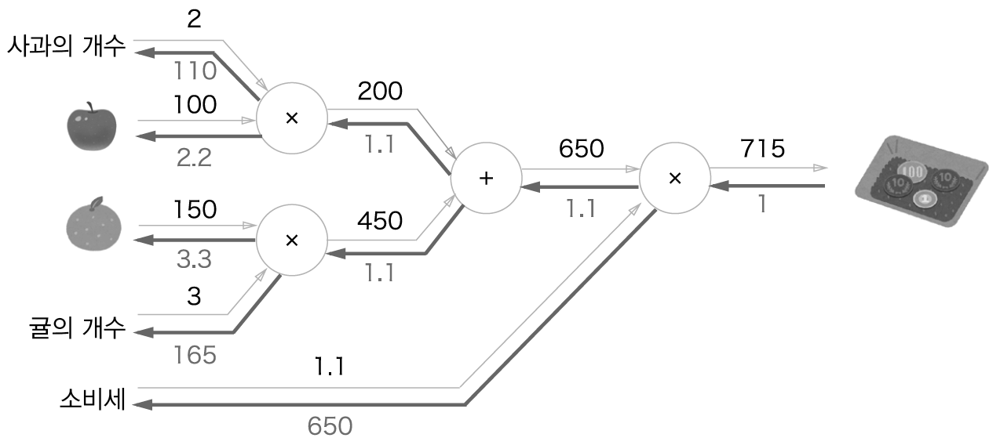

# Chapter05 오차역전파법 (Backpropagation)

- Chapter04 에서는 가중치 매개변수에 대한 손실함수의 기울기를 수치 미분을 사용해 구했다.
- 하지만 수치 미분은 단순하고 구현하기도 쉽지만 계산 시간이 너무 오래 걸린다.
- 그래서 이번 장에서는 가중치 매개변수의 기울기를 효과적으로 계산하는 `오차역전파법(backpropagation)`에
대하여 학습할 것이다.
- 오차역전파법을 제대로 이해하는 방법에는 두 가지가 있다.
  - 하나는 수식을 통한 것
  - 다른 하나는 계산 그래프를 통한 것
- 기계학습을 다루는 책 대부분은 수식을 중심으로 이야기를 전개하지만 이번 장에서는 계산 그래프를 사용하여
'시각적'으로 이해를 해보도록 하겠다.


## 5.1 계산 그래프

- `계산 그래프 (computational graph)`는 계산 과정을 그래프로 나타낸 것이다.
- 여기에서의 그래프는 복수의 node와 edge로 표현된다.
- 이번 절에서는 계산 그래프에 친숙해지기 위해 간단한 문제에서부터 한 단계씩 나아가면서 마지막에는 오차 역전파법에
도달하겠다.

### 5.1.1 계산 그래프로 풀다
- 계산 그래프는 뒤에 나올 복잡한 계산에서 진짜 위력을 발휘하므로 지금 사용법을 익혀둬야 한다.
- 먼저 간단한 문제를 통해 계산 그래프에 익숙해져보자.
- 문제 1 : 슈퍼에서 1개에 100원인 사과를 2개 샀다. 이때 지불 금액을 구하자. 단 소비세가 10% 부과된다.
- 이를 계산 그래프로 나타내보자


- 처음에 사과의 100원이 'x' 노드로 흐르고 '사과의 개수'라는 변수랑 곱해져 200원이 되었다.
- 또한 이 200원은 다음 'x' 노드로 흘러 '소비세'라는 변수와 곱해져 220원이 되었다.

- 그럼 또 다른 문제를 풀어보자
- 문제 2 : 슈퍼에서 사과 2개, 귤 3개를 샀다. 사과는 1개에 100원, 귤은 1개 150원이다. 소비세가 10%
일 때 지불 금액을 구해라


- 이 문제에서는 덧셈 노드인 '+'가 새로 등장하여 사과와 귤의 금액을 합산한다.
- 계산 그래프는 왼쪽에서 오른쪽으로 계산을 진행한다.
- 지금까지 살펴본 것 처럼 계산 그래프를 이용한 문제 풀이는 다음 흐름과 같다.
  1. 계산 그래프를 구성한다.
  2. 그래프에서 계산을 왼쪽에서 오른쪽으로 진행한다.
- 여기서 2번째 '계산을 왼쪽 -> 오른쪽 으로 진행'하는 단계를 `순전파(forward propagation)`라고 하낟.
- 순전파는 계산 그래프의 출발점부터 종착점으로의 전파이다.
- 순전파라는 이름이 있다변 반대 방향의 전파도 있는데(오른쪽 -> 왼쪽), 이를 `역전파(backward propagation)`
라고 한다.
- 이 역전파는 이후에 미분을 계산할 때 중요한 역할을 한다.


### 5.1.2 국소적 계산
- 계산 그래프의 특징은 '국소적 계산'을 전파함으로써 최종 결과를 얻는다는 점이다.
- 여기서 국소적이란 '자신과 직접 관계된 작은 범위'라는 뜻이다.
- 각 노드는 에지에서 들어오는 값이 어떻게 계산되었느냐와는 상관없이, 단지 들어온 엣지의 값으로 자신의 연산만 수행
하여 다음 노드(혹은 엣지)로 전달하기만 하면 된다.
- 즉, 각 노드는 자신과 관련한 계산 외에는 아무것도 신경 쓸 게 없다.
- 이처럼 계산 그래프는 국소적 계산에 집중하며 전체 계산이 제아무리 복잡하더라도 각 단계에서 하는 일은 해당 노드의
'국소적 계산'이다.
- 국소적 계산은 단순하지만 그 결과를 전달함으로써 전체를 구성하는 복잡한 계산을 해낼 수 있다.


### 5.1.3 왜 계산 그래프로 푸는가 ? 
- 지금까지 계산 그래프를 사용하여 문제를 풀어봤는데, 그럼 계산 그래프의 이점은 무엇일까 ? 
  1. '국소적 계산'이다. 전체가 아무리 복잡해도 각 노드에서는 단순한 계산에만 집중하여 문제를 단순화할 수 있다.
  2. 계산 그래프는 중간 계산 결과를 모두 보관할 수 있다. 예를 들어 사과 2개까지 계산 했을 때의 금액은 200원이다.
  3. `가장 큰 이유는 바로 역전파를 통해 '미분'을 효율적으로 계산할 수 있다는 점이다.`

- 아까 문제 1에 대해서, 사과 가격이 오르면 최종 금액에 어떤 영향을 끼치는지 알고 싶다고 해보자.
- 이는 '사과 가격에 대한 지불금액의 미분'을 구하는 문제다.
- 기호로 나타내면 사과 값을 x, 지불 금액을 L 이라고 했을 때 dL / dx 를 구하는 것이다.
- 이 미분 값은 사과 값이 '아주 조금' 올랐을 때 지불 금액이 얼마나 증가하느냐를 표시한 것이다.
- 앞에서 말했듯이 '사과 가격에 대한 지불 금액의 미분'같은 값은 계산 그래프에서 역전파를 하면 구할 수 있다.
- 먼저 결과를 보자.


- 역전파는 순전파와는 반대 방향의 화살표(굵은 선)으로 그린다.
- 이 전파는 '국소적 미분'을 전달하고 그 미분 값은 화살표의 아래에 적는다.
- 이 예에서는 오른쪽 -> 왼쪽 방향으로 1 -> 1.1 -> 2.2 순으로 미분 값을 전달한다.
- 이 결과로부터 사과 가격에 대한 지불 금액의 미분 값은 2.2라고 할 수 있고, 이는 사과가 1원 오르면 최종
금액은 2.2원 오른다고 해석할 수 있다.
- 여기에서는 사과 가격에 대한 미분만 구했지만, '소비세에 대한 지불 금액의 미분'이나 '사과 개수에 대한 지불
금액의 미분'도 같은 순서로 구할 수 있다.
- 그리고 그때는 중간까지 구한 미분 결과를 공유할 수 있어 다수의 미분을 효율적으로 계산할 수 있다.
- 이처럼 계산 그래프의 이점은 순전파와 역전파를 활용해 각 변수의 미분을 효율적으로 구할 수 있다는 것이다.


## 5.2 연쇄법칙
- 5.1 에서 설명한 순전파는 계산 결과를 왼쪽에서 오른쪽으로 전달했는데, 이는 평소에 하는 방식이니 자연스럽게
느껴졌을 것이다.
- 하지만 역전파는 '국소적인 미분'을 순방향과는 반대인 오른쪽에서 왼쪽으로 전달하는데 이 원리는 `연쇄법칙(chain rule)`
에 따른 것이다.
- 이번 절에서는 연쇄법칙을 설명하고 그것이 계산 그래프 상의 역전파와 같다는 사실을 밝히겠다.


### 5.2.1 계산 그래프의 역전파
- 일단 계산 그래프를 사용한 역전파의 예 하나를 살펴보자.
- y=f(x)라는 계산의 역전파이다.


- 다음 그림과 같이 역전파의 계산 절차는 신호 E에 노드의 국소적 미분 값인 dy/dx 를 곱한 후 다음 노드로 전달하는 것이다.
- 여기서 말하는 국소적 미분 값이란 y=f(x) 계산의 미분을 구하는 것이며 x에 대한 y의 미분 dy/dx를 뜻한다.
- 가령 y=f(x)=x^2 이라면 dy/dx = 2x 가된다.
- 그리고 이 국소적 미분을 상류에서 전달된 값 (E)에 곱해 앞쪽 노드로 전달하는 것이다.
- 이것이 역전파의 계산 순서이며 이러한 방식을 따르면 목표로 하는 미분 값을 효율적으로 구할 수 있다는 것이 역전파의 핵심이다.
- 왜 이런 일이 가능한지는 연쇄법칙의 원리로 설명할 수 있다. 5.2.2에서 계속 설명하겠다.


### 5.2.2 연쇄법칙이란?
- 연쇄법칙을 설명하려면 우선 합성 함수부터 알아야 한다.
- 합성 함수란 여러 함수로 구성된 함수이다.
- 예를 들어 z = (x + y)^2 이라는 식은 다음과 같은 두 개의 식으로 구성된다.
  - z = t^2
  - t = x + y
- 연쇄법칙은 합성 함수의 미분에 대한 성질이며, 다음과 같이 정의된다.
  - "합성 함수의 미분은 합성 함수를 구성하는 각 함수의 미분의 곱으로 나타낼 수 있다."
- 이것이 연쇄법칙의 원리인데 간단한 성질이다.
- 예로 설명하자면 x에 대한 z의 미분을 구하려고 하면
  - dz/dx = dz/dt * dt/dx 로 나타낼 수 있다는 것이다.
  - 위의 식을 예로 구해보자면 dz/dt = 2t 이고
  - dt/dx = 1 이다.
  - 따라서 dz/dx = 2t * 1 = 2 (x+y) 가 된다.
- 이는 미분 공식에서 해석적으로 구한 결과이다.


### 5.2.3 연쇄법칙과 계산 그래프
- 위의 연쇄법칙 계산을 계산 그래프로 나타내보자.
- 2제곱 계산을 '**2' 노드로 나타내겠다.


- 오른쪽에서 왼쪽으로 신호가 전달된다.
- 역전파의 계산 절차에서는 노드로 들어온 입력 신호에 그 노드의 국소적 미분(편미분)을 곱한 후 다음 노드로 전달한다.
- '**2' 노드에서의 역전파를 보자.
  - 입력은 dz/dz 이며, 여기에 국소적 미분 값인 dz/dt를 곱하고 다음 노드로 넘어갔다.
  - 순전파 시에는 입력이 t 이고 출력이 z 이므로 이 노드에서 국소적 미분은 dz/dt 이다.
  - 역전파의 첫 신호인 dz/dz의 값은 1이라서 앞의 수식에서는 언급하지 않겠다.
- 여기서 주목할 부분은 맨 왼쪽의 역전파인데, 이 계산은 연쇄법칙에 따르면 
  - dz/dz * dz/dt * dt/dx
  - = 1 * dz/dt * dt/dx
  - = dz/dx 
  - 즉 x에대한 z의 미분이 된다.
- 이처럼 역전파가 하는 일은 연쇄 법칙의 원리와 같다는 것이다.
- 5.2.2 의 국소적 미분의 결과를 대입하면 다음 그림과 같다.


## 5.3 역전파
- 앞 절에서는 계산 그래프의 역전파가 연쇄법칙에 따라 진행되는 모습을 설명했다.
- 이번 절에서는 '+'와 'x'등의 연산을 예로 들어 역전파의 구조를 설명할 것이다.


## 5.3.1 덧셈 노드의 역전파
- 먼저 덧셈 노드의 역전파에 대해서 설명하겠다.
- z = x + y 라는 식이 있다.
- 우선 다음 식에 대한 미분은 해석적으로 다음과 같다.
  - dz/dx = 1
  - dz/dy = 1
- 이를 계산 그래프로 나타내보자


- 위의 그림과 같이 역전파 때는 상류에서 전해진 미분에 1을 곱하여 하류로 흘린다.
- 즉 덧셈 노드의 역전파는 1을 곱하기만 할 뿐이므로 입력된 값을 그대로 다음 노드로 보낸다.
- 이 예에서는 상류에서 전해진 미분 값을 dL/dz 라고 했는데 이는 최종적으로 L이라는 값을 출력하는 큰
계산 그래프를 가정하기 때문이다.
- 아래 그림처럼 생각하면 된다.


- 즉, z = x + y 계산은 그 큰 계산 그래프의 중간 어딘가에 존재하고, 상류로부터 dL/dz 값이 전해진 것이다.
- 그리고 다시 하류로는 dL/dx, dL/dy 값을 전달하는 것이다. (dL/dx = dL/dz * dz/dx = dL/dz * 1)


- 이제 구체적인 예를 하나 살펴보자. 
  - 식 : 10 + 5 = 15
  - 상류에서 1.3이라는 값이 흘러온다면


> 이처럼 덧셈 노드 역전파는 입력 신호를 다음 노드로 출력할 뿐이라고 볼 수 있다.


### 5.3.2 곱셈 노드의 역전파
- z = xy 라는식이 있다.
- 다음 식에 대한 해석적 미분은 다음과 같다.
  - dz/dx = y
  - dz/dy = x
- 계산 그래프는 다음과 같다.


- 곱셈 노드 역전파는 상류의 값에 순전파 때의 입력 신호들을 '서로 바꾼 값'을 곱해서 하류로 보낸다.
- 서로 바꾼 값이란 순전파 떄 x를 곱했다면 y를 곱해서 역전파 때 보내고, 순전파 때 y를 곱했다면 x를 곱해서
역전파 때 보낸다는 뜻이다.

  
- 그럼, 구체적인 예를 하나 보자. 
  - 식 : '10 * 5 = 50'
  - 상류에서 1.3 값이 흘러 나올 때


> 곱셈의 역전파에서는 입력 신호를 바꾼 값을 곱하여 하류로 보낸다.<br>
> 덧셈의 역전파에서는 상류의 값을 그대로 흘려보내서 순방향 입력 신호의 값은 필요하지 않았지만
> 곱셈의 역전파는 순방향 입력 신호의 값이 필요하다. <br>
> 그래서 곱셈 노드를 구현할 때는 순전파의 입력 신호를 변수에 저장해야한다.


### 5.3.3 사과 쇼핑의 예

- 자 그럼 이제 이번 장 시작할 때 본 사과 쇼핑의 예를 다시 살펴보자.
- 사과의 개수, 사과의 가격, 소비세 라는 세 변수 각각이 최종 금액에 어떻게 영향을 주느냐를 풀고자 한다.
- 결국, '사과 가격에 대한 지불 금액의 미분', '사과 개수에 대한 지불금액의 미분', '소비세에 대한 지불 금액의 미분'을 
구해야 한다.
- 이를 계산 그래프의 역전파를 통해 풀어보자


- 지금까지 설명한 바와 같이 곱셈 노드는 입력 신호를 바꿔서 곱하여 하류로 흘린다.
- 이 그림을 통해 사과 가격의 미분은 2.2, 사과 개수의 미분은 110, 소비세의 미분은 200 이다 .
- 참고로 소비세의 1은 100%를 의미하고 사과 가격의 1은 1원이다. 소비세와 사과 가격의 단위가 다름에 주의하자.


- 마찬가지로 사과와 귤 쇼핑의 역전파도 해결해보자




## 5.4 단순한 계층 구현하기
- 이번 절에서는 지금까지 보아온 '사과 쇼핑' 예를 파이썬으로 구현한다.
- 계산 그래프의 곱셈 노드를 'MulLayer'
- 덧셈 노드를 'AddLayer'라는 이름으로 구현한다.

> 다음 절에서는 신경망을 구성하는 '계층' 각각을 하나의 클래스로 구현한다. 여기에서 말하는 '계층'이란
> 신경망의 기능 단위다. 예를 들어 시그모이드 함수를 위한 Sigmoid, 행렬 곱을 위한 Affine 등의 기능을
> 계층 단위로 구현한다. 그래서 이번 절에서도 곱셈 노드와 덧셈 노드를 '계층' 단위로 구현한다.


### 5.4.1 곱셈 계층
- 모든 계층은 forward()와 backward()라는 공통의 메서드(인터페이스)를 갖도록 구현할 것이다.
- 곱셉계층은 MulLayer라는 이름의 클래스로 다음과 같이 구현하였다.


```python
class MulLayer:
    def __init__(self):
        self.x = None
        self.y = None
    
    def forward(self, x, y):
        self.x = x
        self.y = y
        out = x * y
        
        return out
    
    def backward(self, dout):
        dx = dout * self.y  # x와 y를 바꾼다.
        dy = dout * self.x 
        
        return dx, dy
```

- __init__()에서는 인스턴스 변수인 x,y를 초기화 하였고 이 두 변수는 순전파 시의 입력 값을 유지하기
위해 사용한다.
- backward()에서는 상류에서 넘어온 미분(dout)에 순전파 떄의 값을 '서로 바꿔'곱한 후 하류로 흘린다.


- 이 MulLayer를 이용하여 앞에서 본 '사과 쇼핑'을 구현해보자

```python
from layer_naive import *


apple = 100
apple_num = 2
tax = 1.1

mul_apple_layer = MulLayer()
mul_tax_layer = MulLayer()

# forward
apple_price = mul_apple_layer.forward(apple, apple_num)
price = mul_tax_layer.forward(apple_price, tax)

# backward
dprice = 1
dapple_price, dtax = mul_tax_layer.backward(dprice)
dapple, dapple_num = mul_apple_layer.backward(dapple_price)

print("price:", int(price))
print("dApple:", dapple)
print("dApple_num:", int(dapple_num))
print("dTax:", dtax)
```
```
결과

price: 220
dApple: 2.2
dApple_num: 110
dTax: 200
```

- backward() 호출 순서는 forward() 때와는 반대이다.
- 또, backward()가 받는 인수는 '순전파의 출력에 대한 미분'임에 주의하자 !


### 5.4.2 덧셈 계층
- 아까 봤던 '사과와 귤 쇼핑'문제를 해결해보자
- 먼저 AddLayer를 구성해보자

```python
class AddLayer:
    def __init__(self):
        pass

    def forward(self, x, y):
        out = x + y

        return out

    def backward(self, dout):
        dx = dout * 1
        dy = dout * 1

        return dx, dy
```

- 덧셈 계층에서는 초기화가 필요 없으니 __init__()에서는 아무 일도 하지 않는다.
- 참고로 pass 가 아무것도 하지말라는 명령어이다.
- backward()에서는 상류에서 내려온 미분 값을 그대로 하류로 흘려준다.


- 이제 '사과 2개와 귤 3개 구입'문제를 해결해보자
```python
from layer_naive import *

apple = 100
apple_num = 2
orange = 150
orange_num = 3
tax = 1.1

# layer
mul_apple_layer = MulLayer()
mul_orange_layer = MulLayer()
add_apple_orange_layer = AddLayer()
mul_tax_layer = MulLayer()

# forward
apple_price = mul_apple_layer.forward(apple, apple_num)  # (1)
orange_price = mul_orange_layer.forward(orange, orange_num)  # (2)
all_price = add_apple_orange_layer.forward(apple_price, orange_price)  # (3)
price = mul_tax_layer.forward(all_price, tax)  # (4)

# backward
dprice = 1
dall_price, dtax = mul_tax_layer.backward(dprice)  # (4)
dapple_price, dorange_price = add_apple_orange_layer.backward(dall_price)  # (3)
dorange, dorange_num = mul_orange_layer.backward(dorange_price)  # (2)
dapple, dapple_num = mul_apple_layer.backward(dapple_price)  # (1)

print("price:", int(price))
print("dApple:", dapple)
print("dApple_num:", int(dapple_num))
print("dOrange:", dorange)
print("dOrange_num:", int(dorange_num))
print("dTax:", dtax)
```
```
결과

price: 715
dApple: 2.2
dApple_num: 110
dOrange: 3.3000000000000003
dOrange_num: 165
dTax: 650
```

- 코드가 길어졌지만 하나하나의 명령은 단순하다.
- 그냥 필요한 계층을 만들어 순전파 메서드를 호출한다.
- 그리고 순전파와 반대 순서로 역전파 매서드를 호출하면 끝이다~

> 이처럼 계산 그래프에서의 계층(여기에서는 곱셈과 덧셈)은 쉽게 구현 가능하며, 이를 사용해 복잡한
> 미분도 계산할 수 있다. 다음 절에서는 신경망에서 사용하는 계층을 구현할 것입니다.


## 5.5 활성화 함수 계층 구현하기
- 드디어 계산 그래프를 신경망에 적용할 때가 왔다.
- 여기에서는 신경망을 구성하는 층(계층) 각각을 클래스 하나로 구현할 것이다.
- 우선은 활성화 함수인 ReLU와 Sigmoid 계층을 구현해보자.


### 5.5.1 ReLU 계층
- 먼저 ReLU의 수식과 x에 대한 y의 미분은 다음과 같고 ReLU계층의 계산 그래프는 다음과 같이 표현할 수 있다.


- 이제 이 ReLU 계층을 구현해보자
- 신경망 계층의 forward()와 backward() 함수는 넘파이 배열을 인수로 받는다고 가정한다.
- common/layers.py 에 존재한다.

```python
class Relu:
    def __init__(self):
        self.mask = None

    def forward(self, x):
        self.mask = (x <= 0)
        out = x.copy()
        out[self.mask] = 0

        return out

    def backward(self, dout):
        dout[self.mask] = 0
        dx = dout

        return dx
```

- mask라는 인스턴스 변수를 가지고 mask 는 True/False로 구성된 넘파이 배열이다.
- 순전파의 입력인 x의 원소 값이 0 이하인 인덱스는 True, 그 외(0보다 큰 원소)는 False로 유지한다.
- 예컨대 mask 변수는 다음 예와 같이 True/False로 구성된 넘파이 배열을 유지한다.

```
x = np.array([[1.0, -0.5], [-2.0, 3.0]])
mask = (x <= 0) 일때
print(mask) 결과

[[False True]
[True False]]
```

- 순전파 때의 입력 값이 0 이하면 역전파 때의 값은 0이 되어야 한다.
- 그래서 역전파 때는 순전파 때 만들어준 mask를 이용하여 maks 원소가 True인 곳에는 상류에서 전파된 dout을
0으로 설정하였다.

> ReLU 계층은 전기 회로의 '스위치'에 비유할 수 있다. 순전파 때 전류가 흐르고 있으면 스위치를 ON으로 하고,
> 흐르지 않으면 OFF로 하는 것과 똑같다. 역전파 때는 스위치가 ON 이라면 전류가 그대로 흐르고, OFF라면
> 더 이상 흐르지 않는다.


### 5.5.2 Sigmoid 계층

- 이번엔 시그모이드 함수 차례이며, 시그모이드 함수는 다음 식을 의미하는 함수이다.
- y = 1 / 1 + exp(-x)
- 이 식을 계산 그래프로 그려보자.


- 'exp'와 '/' 노드가 새롭게 등장했다.
- 'exp' 노드는 y = exp(x) 계산을 수행하고
- '/' 노드는 y = 1/x 계산을 수행한다.


> 위의 그림과 같이 시그모이드 함수 식은 국소적 계산의 전파로 이루어진다. 
> 이제부터 오른쪽 '/'노드부터 하나씩 역전파를 살펴보겠다


1. 1단계 : 
 - '/'노드의 계산은 y 1/x 이다.
 - dy/dx = -1 / x^2 = -y^2  이다.
 - 즉, 역전파 때는 상류에서 흘러온 값에 순전파의 출력을 제곱한 후 마이너스를 붙여 곱한 값을 하류로 전달하면 된다.
 - 예를 들어, 상류에서 dL/dy 가 흘러들어왔을 떄, dL/dy * dy/dt 를 하류로 보내야한다. ('/'노드의 입력이 t라고 가정)
 - 그러면 y = 1/t 이고 dy/dt = -y^2 이므로 '/' 노드에서는 하류로  dL/dy * -y^2 을 흘려보내야 한다.

2. 2단계 : 
  - '+' 노드는 상류의 값을 그냥 하류로 보내기 때문에 그냥 - dL/dy * y^2을 흘려보내면 된다.

3. 3단계 : 
   - exp 노드는 y = exp(t) (입력이 t일때) 연산을 수행한다.
   - dy / dt = exp(t) 이다.
   - 즉, 상류의 값에 'exp' 노드의 입력으로 들어오는 값에 exp를 취하여 곱해주면된다.
   - 그러므로 'exp'에서는  '-dL/dy * y^2 * exp(-x)' 가 하류로 전파된다.

4. 4단계 :
  - 'x' 단계에서는 입력의 순서만 바뀌면되므로 '-1'만 곱해져서 하류로 보내면 된다.
  - 따라서 마지막 단계에서는 'dL/dy * y^2 * exp(-x)' 가 하류로 전파된다.

> 지금까지의 역전파를 계산 그래프로 나타내보겠다.


- 여기에서 역전파의 최종 출력인 'dL/dy * y^2 * exp(-x)'는 시그모이드 순전파의 입력인 x와 출력인
y 만으로 계산할 수 있다는 것을 눈치채야한다.
- 따라서 아까 4단계에 걸친 내용을 다음과 같이 'sigmoid' 노드 하나로 대체할 수 있다.


- 또한 'dL/dy * y^2 * exp(-x)' 식을 다음과 같이 정리할 수 있다.


> 이처럼 Sigmoid 계층의 역전파는 순전파의 출력(y)만으로 계산할 수 있으며 이를 코드로 구현해보자


```python
class Sigmoid:
    def __init__(self):
        self.out = None

    def forward(self, x):
        out = 1 / (1 + np.exp(-x))
        self.out = out
        return out

    def backward(self, dout):
        dx = dout * (1.0 - self.out) * self.out

        return dx
```

> 이 구현에서는 순전파의 출력을 인스턴스 변수 out에 보관했다가, 역전파 계산 때 그 값을 사용한다.


## 5.6 Affine/Softmax 계층 구현하기

### 5.6.1 Affine 계층
- 먼저 3.3 절에서 했던 내용을 복습해보자.
- 신경망의 순전파에서는 가중치 신호의 총합을 계산하기 때문에 행렬의 곱 (넘파이에서는 np.dot()) 을 사용했다.
- 예를 들어 파이썬으로 다음과 같이 구현했다.

```python
import numpy as np

X = np.random.rand(2)
W = np.random.rand(2,3)
B = np.random.rand(3)

print(X.shape)
print(W.shape)
print(B.shape)

Y = np.dot(X,W) + B

print(Y.shape)
```
```
결과

(2,)
(2,3)
(3,)
(3,)
```

- 여기서 X, W, B 는 각각 형상이 (2,), (2,3), (3,)인 다차원 배열이다.
- 그리고 Y를 'Y = np.dot(X,W) + B' 형태로 구하여 활성화 함수로 변환해 다음 층으로 전파하는 것이 신경망 순전파의
흐름이었다.
- 그리고 행렬의 곱 계산은 대응하는 차원의 원소 수를 일치하는 것이 핵심이였고 X와 W의 곱에서는 각 shape의 앞에 있는
숫자가 2로 일치한다.
- 행렬의 계산에서 1*2 행렬과 2*3 행렬의 형상은 넘파이의 shape 함수 기준으로 (2,) 와 (2,3) 로 나타낼 수 있음에 주의하자.
- 따라서 1*2 행렬일 경우 (row 벡터인 경우) shape은 (2,) 처럼 나타낼 수 있고 (2,~) 인 다차원의 배열과 곱해질 수 있다.
  - 위에 부분에 더 설명해보자면 (2,) 인 배열과 곱해지면 스칼라 값(내적값)이 나오고 이떄 형상은 () 이 출력된다.
  - (2,3) 인 2차원 배열과 곱해지면 1*2 와 2*3 행렬과 곱해진다고 생각하면 되고 이떄 결과 형상은 (3,)이 된다.
  - 다음과 같은 코드를 보면 더 쉽게 이해할 수 있다.
  ```python
  import numpy as np
  
  X = np.array([1,2])
  X2 = np.array([[1],[2]])
  X3 = np.array([1,2])
  
  print(X.shape) # (2,)
  print(X2.shape) # (2,1)
  print(X3.shape) # (2,)
  
  XX2 = np.dot(X,X2)
  XX3 = np.dot(X,X3)
  
  print(XX2.shape) # (1,)
  print(XX3.shape) # ()
  print(XX3) # 5
  ```

- 이제 본격적으로 설명을 해보자면 신경망에서 X*W = O 의 연산을 할 경우 Numpy의 shape 기준으로는 다음과 같이
표기된다.


> 신경망의 순전파 때 수행하는 행렬의 곱은 기하학에서는 `어파인 변환(Affine transformation)`이라고 한다.
> 따라서 어파인 변환을 수행하는 처리를 'Affine 계층'이라는 이름으로 구현할 것이다.

- 이제 앞에서 수행한 계산 (행렬의 곱과 편향의 합)을 계산 그래프로 나타내보자. 또한 각 변수의 이름 위에 그 변수의
형상도 표기할 것이다.


- 여기서 X, W, B 가 행렬(다차원 배열)이라는 점에 주의만 하면 된다.
- 지금까지의 계산 그래프에서는 노드 사이에 '스칼라 값'이 흘렀지만 여기서는 행렬이 흐르고 있다고 생각하면 된다.


- 자 그럼 이제 이 계산 그래프의 역전파에 대하여 생각해보자.
- 먼저 전체 Affine 계층의 역전파 부터 살펴 보겠다.


- 복잡해보이지만 어려울 것 없다. 단지 스칼라에서 행렬이 흐르는 것 뿐이다.
- 스칼라에서 행렬이 흐른다는 것은 각 행렬의 형상만 주의해서 살펴보면 된다는 것이다.
- 먼저 dL/dX, dL/dW 의 형상에 대하여 살펴보자. 
- X와 dL/dX의 형상이 같다는 것은 다음 식을 보면 이해할 수 있다.

$$
\(X = (x_0, x_1, \ldots, x_n)\)
$$
$$
\(\frac{dL}{dX} = \left(\frac{dL}{dx_0}, \frac{dL}{dx_1}, \ldots, \frac{dL}{dx_n}\right)\)
$$


