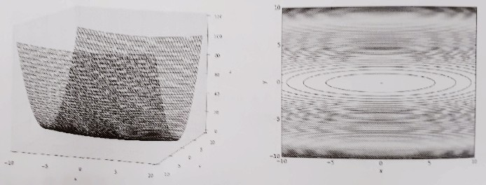
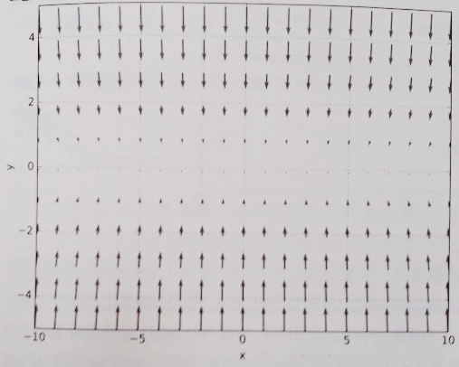
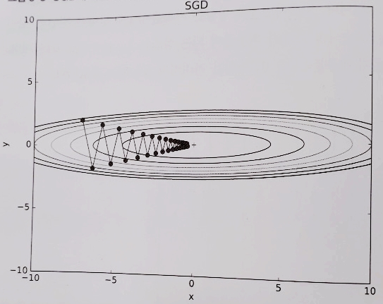
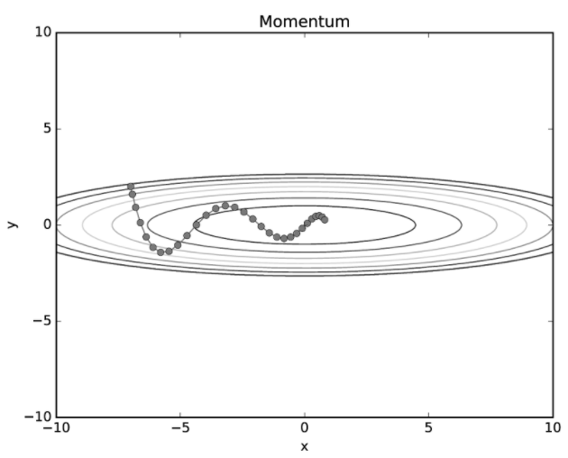
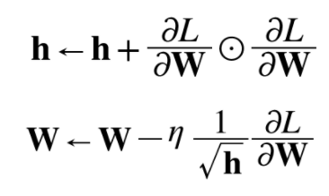
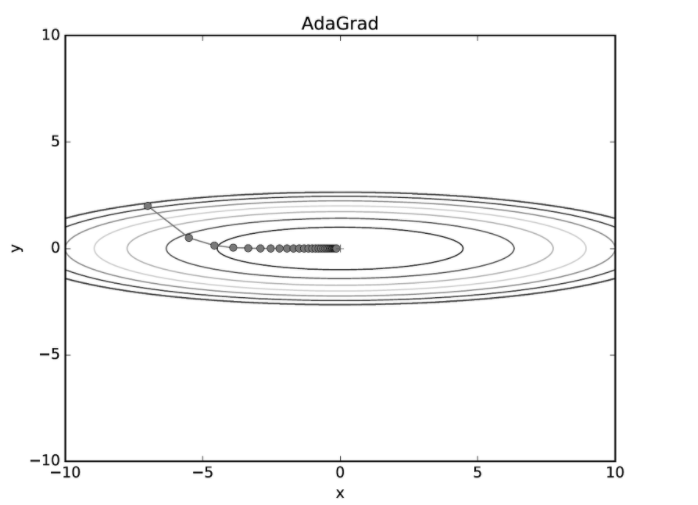
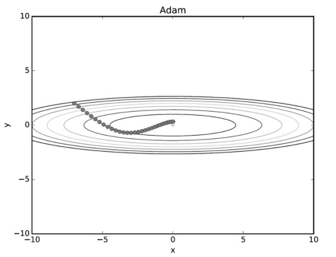

# Chapter6 학습 관련 기술들

- 이번 장에서는 신경망 학습의 핵심 개념들을 알아볼 것이다.
- 이번 장에서 다룰 주제는 다음과 같다.
  - 가중치 매개변수의 최적값을 탐색하는 최적화 방법
  - 가중치 매개변수 초깃값
  - 하이퍼파라미터 설정 방법
  - 오버피팅의 대응책인 가중치 감소와 드롭아웃 등의 정규화 방법
  - 배치 정규화
- 이번 장에서 설명하는 기법을 이용하면 신경망(딥러닝) 학습의 효율과 정확도를 높일 수 있다.


## 6.1 매개변수 갱신
- 신경망 학습의 목적은 손실 함수의 값을 가능한 한 낮추는 매개변수를 찾는 것이다.
- 이는 곧 매개변수의 최적값을 찾는 문제이며, 이러한 문제를 푸는 것을 `최적화(optimization)`이라고 한다.
- 우리는 최적화를 하기 위해 매개변수의 기울기(미분)을 이용했다.
- 매개변수의 기울기를 구해, 기울어진 방향으로 매개변수 값을 갱신하는 일을 몇 번이고 반복해서 점점 최적의 값에 도달했다.
- 이러한 단순한 방법을 확률적 경사 하강법(SGD)이라 한다.
- 문제에 따라서는 SGD 보다 똑똑한 방법도 있으며 이제부터는 SGD의 단점을 알아본 후 SGD와는 다른 최적화 기법을 소개하겠다.

### 6.1.1 모험가 이야기
- SGD를 지도도없고 눈도 안보이는 모험가에 비유했다.
- 지도도 없고 눈도 안보이는 모험가는 땅의 기울기만을 이용하여 가장 낮은 골짜기를 찾으려고 한다.
- 지금 서 있는 장소에서 발바닥으로 기울기를 느껴 가장 크게 기울어진 방향으로 가는 것을 SGD의 전략이라고 비유 하였다.


### 6.1.2 확률적 경사 하강법(SGD)
- SGD를 복습해 보겠으며 SGD에서 가중치 갱신은 다음과 같이 이루어진다.
  - W = W - lr*dL/dW
  - W는 갱신할 가중치 매개변수
  - lr는 학습률을 의미하며 실제로는 0.01 이나 0.001과 같은 값을 미리 정해서 사용
  - dL/dW 는 가중치 매개변수에 대한 손실 함수의 기울기
  - 즉, SGD는 기울어진 방향으로 일정 거리만큼 매개변수를 조정하겠다는 최적화 방법이다.
- 파이썬 코드로 구현해보겠다.
  ```python
  class SGD:
      def __init__(self, lr=0.01):
          self.lr = lr
      
      def update(self, params, grads):
          for key in params.keys():
              params[key] -= self.lr * grads[key]
  ```

- 인수인 params와 grads는 지금까지의 신경망 구현과 마찬가지로 딕셔너리 변수이다.
- params['W1'], grads['W1']과 같은 형태로 쓰이며 각각 가중치 매개변수와 기울기를 저장하고 있다.
- 이러한 SGD 클래스를 다음과 같이 사용할 수 있다.
  ```python
  network = TwoLayerNet(...)
  optimizer = SGD()
  
  for i in range(10000):
      ...
      x_batch, t_batch = get_mini_batch(...) # 미니배치
      grads = network.gradient(x_batch, t_batch)
      params = network.params
      optimizer.update(params, grads)
      ...
  ```

- 이처럼 최적화를 담당하는 클래스를 분리해서 구현하여 기능을 모듈화 하였다.
- 예를 들어 곧이어 소개할 모멘텀이라는 최적화 기법 역시 update(params, grads)라는 공통의 메서드를 갖도록 구현한다.
- 그럼 optimizer = SGD()를 그냥 optimizer = Momentum()으로만 변경하면 SGD가 모멘텀으로 바뀌는 것이다.


> 대부분 딥러닝 프레임워크는 다양한 최적화 기법을 구현해 제공하며. 원하는 기법으로 쉽게 바꿀 수 있는 구조로 되어 있다.


### 6.1.3 SGD의 단점
- SGD는 단순하고 구현도 쉽지만, 문제에 따라서는 비효율적일 때가 있다.
- 다음 식을 봐보자 
  - f(x,y) = 1/20x^2 + y^2

- 이 그래프와 그 등고선을 보면 '밥그릇'을 x축 방향으로 늘인 듯한 모습이고, 
실제로 그 등고선은 오른쪽과 같이 x축 방향으로 늘인 타원으로 되어 있다.



- 함수의 기울기를 그려보면 밑의 그림 처럼 된다.



- 이 기울기는 y축 방향은 크고 x축 방향은 작다는 것이 특징이다.
- 말하자면 y축 방향은 가파른데 x축 방향은 완만한 것이다.
- 또한, 최솟값이 되는 좌표는 (x,y) = (0,0)이지만, 그림에서 보여주는 기울기 대부분은 (0,0) 방향을 가리키지 않는다.


- 이제 이 함수에 SGD를 적용해보자. 초깃값은 (-7.0, 2.0)으로 하겠다.



- 이처럼 심하게 굽이진 움직임을 보여주며, 이는 상당히 비효율적인 움직임이다.
- 즉, SGD의 단점은 비등방성(anisotropy) 함수 (방향에 따라 기울기가 달라지는 함수)에서는 탐색 경로가 비효율적이라는 것이다.
- 이럴 때는 SGD 같이 무작정 기울어진 방향으로 진행하는 단순한 방식보다 더 영리한 방식이 필요하다.
- 또한 SGD가 지그재그로 탐색하는 근본 원인은 기울어진 방향이 본래의 최솟값과 다른 방향을 가리켜서라는 점도 있다.

> 이제부터 SGD의 이러한 단점을 개선해주는 모멘텀, AdaGrad, Adam 이라는 세 방법을 소개하겠다.


### 6.1.4 모멘텀
- 모멘텀(Momentum)은 '운동량'을 뜻하는 단어로, 물리와 관계가 있다.
- 모멘텀 기법은 수식으로는 다음과 같다.
  - v = av - lr * dL/dW
  - W = W + v
  - W, lr, dL/dW는 SGD와 동일한 변수이다.
  - v가 새로 등장하는데 이는 물리에서 말하는 속도(velocity)에 해당한다.
- 이 수식은 기울기 방향으로 힘을 받아 물체가 가속된다는 물리 법칙을 나타낸다.
- 또한 av 항은 물체가 아무런 힘을 받지 않을 때 서서히 하강시키는 역할을 한다. (a는 0.9 등의 값으로 설정)
- 물리에서의 지면 마찰이나 공기 저항에 해당한다.
- 다음은 모멘텀의 구현 코드이다. (common/optimizer.py)
  ```python
  class Momentum:
      """모멘텀 SGD"""
  
      def __init__(self, lr=0.01, momentum=0.9):
          self.lr = lr
          self.momentum = momentum
          self.v = None
  
      def update(self, params, grads):
          if self.v is None:
              self.v = {}
              for key, val in params.items():
                  self.v[key] = np.zeros_like(val)
  
          for key in params.keys():
              self.v[key] = self.momentum * self.v[key] - self.lr * grads[key]
              params[key] += self.v[key]
  ```
  - 인스턴스 변수 v가 물체의 속도이다.
  - v는 초기화 때는 아무 값도 담지 않고, 대신 update()가 처음 호출될 때 배개변수와 같은 구조의 데이터(값은 모두 0)를
  딕셔너리 변수로 저장한다.
  - 나머지 부분은 위의 모멘텀 수식을 코드로 옮긴 것이다.


- 이제 모멘텀을 사용해서 최적화 문제를 풀어보자. 결과는 다음과 같다.



- 그림에서 보듯 모멘텀의 갱신 경로는 공이 경사진 바닥을 구르듯 움직인다.
- SGD와 비교하면 '지그재그 정도'가 덜한 것을 알 수 있다.
- 이는 x축의 힘은 아주 작지만 방향은 변하지 않아서 한 방향으로 일정하게 가속하기 때문이다.
- 거꾸로 y축의 힘은 크지만 위아래로 번갈아 받아서 상충하여 y축 방향의 속도는 안정적이지 않다.
- 전체적으로는 SGD보다 x축 방향으로 빠르게 다가가 지그재그 움직임이 줄어든다.


### 6.1.5 AdaGrad
- 신경망 학습에서는 학습률 값이 중요하다.
- 이 값이 너무 작으면 학습 시간이 너무 길어지고, 반대로 너무 크면 발산하여 학습이 제대로 이뤄지지 않는다.
- 이 학습률을 정하는 효과적 기술로 `학습률 감소(learning rate decay)`가 있다.
- 이는 학습을 진행하면서 학습률을 점차 줄이는 방법이다.
- 말 그대로 처음에는 크게 학습하다가 조금씩 작게 학습한다는 방법으로 신경망 학습에 자주 쓰인다.
- 학습률을 서서히 낮추는 가장 간단한 방법은 매개변수 '전체'의 학습률 값을 일괄적으로 낮추는 것이다.
- 이를 더욱 발전시킨 것이 AdaGrad이며, AdaGrad는 '각각의' 매개변수에 '맞춤형' 값을 만들어준다.
- AdaGrad는 개별 매개변수에 adaptive(적응적으로) 학습률을 조정하면서 학습을 진행한다.
- 수식은 다음과 같다.



- 새로 h라는 변수가 등장하는데 기존 기울기 값을 제곱하여 계속 더해준다.
- 그리고 매개변수를 갱신할 때(두번 째 식에서), h에 루트를 씌어 역수를 취한 값을 곱해 학습률을 조정한다.
- 즉, 매개변수의 원소 중에서 많이 움직인(기울기가 커서 크게 갱신된) 원소는 학습률이 낮아진다는 뜻이다.
- 다시 말해 학습률 감소가 매개변수의 원소마다 다르게 적용됨을 뜻한다.
- 참고로 h식에서 dL/dW 사이의 기호는 행렬의 원소별 곱셈을 의미한다.

> AdaGrad는 과거의 기울기를 제곱하여 계속 더해간다. 그래서 학습을 진행할 수록 갱신 강도가 약해지며 무한히 학습
> 한다면 어느 순간 갱신량이 0이 되어 전혀 갱신되지 않다. 이 문제를 개선한 기법으로서 RMSProp라는 방법이 있다.
> 이 방법은 과거의 모든 기울기를 균일하게 더해가는 것이 아닌, 먼 과거의 기울기는 서서히 잊고 새로운 정보를 크게 반영하며 이를
> 지수이동평균(Exponential Moving Average, EMA)라 하여, 과거 기울기의 반영 규모를 기하급수적으로 감소시킨다.


- 그럼 AdaGrad의 구현을 보자 
  ```python
  class AdaGrad:
      """AdaGrad"""
  
      def __init__(self, lr=0.01):
          self.lr = lr
          self.h = None
  
      def update(self, params, grads):
          if self.h is None:
              self.h = {}
              for key, val in params.items():
                  self.h[key] = np.zeros_like(val)
  
          for key in params.keys():
              self.h[key] += grads[key] * grads[key]
              params[key] -= self.lr * grads[key] / (np.sqrt(self.h[key]) + 1e-7)
  ```
  - 여기서 주의할 부분은 마지막 줄에서 1e-7이라는 작은 값을 더하는 부분인데 이 작은 값은 self.h[key]가
  0일 수도 있어 0으로 나눠주는 부분을 예외처리 하기 위해 더한 것이다.
  - 대부분 딥러닝 프레임워크에서는 이 값도 인수로 설정할 수 있다.


- 그럼 이렇게 구현한 AdaGrad를 사용해서 최적화 문제를 풀어보자.



- 위의 그림을 보면 최솟값을 향해 효율적으로 움직이는 것을 볼 수 있다.
- y축 방향은 기울기가 커서 처음에는 크게 움직이지만, 그 큰 움직임에 비례해 갱신 정도도 큰 폭으로 작아지도록
조정된다.
- 그래서 y축 방향으로 갱신 강도가 빠르게 약해지고, 지그재그 움직임이 줄어든다.


### 6.1.6 Adam

- 모멘텀은 공이 기울어진 바닥을 구르는 듯한 움직임을 보였다.
- AdaGrad는 매개변수의 원소마다 적응적으로 갱신 정도를 조정했다.
- 이제 이 두 기법을 융합해보자는 생각에서 만들어진 기법이 바로 `Adam이다.`


- Adam은 2015년에 제안된 새로운 방법으로 이론은 조금 복잡하지만 직관적으로는 모멘텀과 AdaGrad를 융합한 듯한 방법이다.
- 이 두 방법의 이점을 조합했다면 매개변수 공간을 효율적으로 탐색해줄 것으로 기대할 수 있을 것이다.
- 또한 하이퍼파라미터의 '편향 보정'이 진행된다는 점도 Adam의 특징이다.
- 이제 더 깊게 파고들진 않을 것이고 궁금한 사람은 원논문을 참고하고, commom/optimizer.py에 구현한 Adam클래스를
보면 된다.
- 그럼 Adam을 사용하여 최적화 문제를 풀어보자.



- 다음 그림과 같이 Adam 갱신 과정도 그릇 바닥을 구르듯 움직인다.
- 모멘텀과 비슷한 패턴인데, 모멘텀 때보다 공의 좌우 흔들림이 적다.
- 이는 학습의 갱신 강도를 Adaptive하게 조정해서 얻은 결과이다.


### 6.1.7 어느 갱신 방법을 이용할 것인가?


