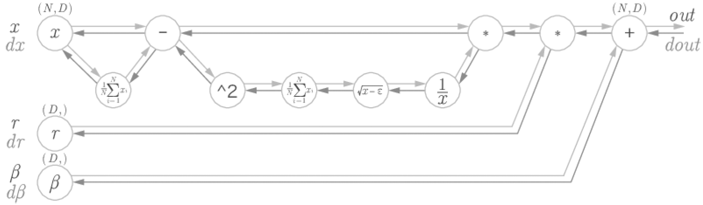

# Chapter6 학습 관련 기술들

- 이번 장에서는 신경망 학습의 핵심 개념들을 알아볼 것이다.
- 이번 장에서 다룰 주제는 다음과 같다.
  - 가중치 매개변수의 최적값을 탐색하는 최적화 방법
  - 가중치 매개변수 초깃값
  - 하이퍼파라미터 설정 방법
  - 오버피팅의 대응책인 가중치 감소와 드롭아웃 등의 정규화 방법
  - 배치 정규화
- 이번 장에서 설명하는 기법을 이용하면 신경망(딥러닝) 학습의 효율과 정확도를 높일 수 있다.


## 6.1 매개변수 갱신
- 신경망 학습의 목적은 손실 함수의 값을 가능한 한 낮추는 매개변수를 찾는 것이다.
- 이는 곧 매개변수의 최적값을 찾는 문제이며, 이러한 문제를 푸는 것을 `최적화(optimization)`이라고 한다.
- 우리는 최적화를 하기 위해 매개변수의 기울기(미분)을 이용했다.
- 매개변수의 기울기를 구해, 기울어진 방향으로 매개변수 값을 갱신하는 일을 몇 번이고 반복해서 점점 최적의 값에 도달했다.
- 이러한 단순한 방법을 확률적 경사 하강법(SGD)이라 한다.
- 문제에 따라서는 SGD 보다 똑똑한 방법도 있으며 이제부터는 SGD의 단점을 알아본 후 SGD와는 다른 최적화 기법을 소개하겠다.

### 6.1.1 모험가 이야기
- SGD를 지도도없고 눈도 안보이는 모험가에 비유했다.
- 지도도 없고 눈도 안보이는 모험가는 땅의 기울기만을 이용하여 가장 낮은 골짜기를 찾으려고 한다.
- 지금 서 있는 장소에서 발바닥으로 기울기를 느껴 가장 크게 기울어진 방향으로 가는 것을 SGD의 전략이라고 비유 하였다.


### 6.1.2 확률적 경사 하강법(SGD)
- SGD를 복습해 보겠으며 SGD에서 가중치 갱신은 다음과 같이 이루어진다.
  - W = W - lr*dL/dW
  - W는 갱신할 가중치 매개변수
  - lr는 학습률을 의미하며 실제로는 0.01 이나 0.001과 같은 값을 미리 정해서 사용
  - dL/dW 는 가중치 매개변수에 대한 손실 함수의 기울기
  - 즉, SGD는 기울어진 방향으로 일정 거리만큼 매개변수를 조정하겠다는 최적화 방법이다.
- 파이썬 코드로 구현해보겠다.
  ```python
  class SGD:
      def __init__(self, lr=0.01):
          self.lr = lr
      
      def update(self, params, grads):
          for key in params.keys():
              params[key] -= self.lr * grads[key]
  ```

- 인수인 params와 grads는 지금까지의 신경망 구현과 마찬가지로 딕셔너리 변수이다.
- params['W1'], grads['W1']과 같은 형태로 쓰이며 각각 가중치 매개변수와 기울기를 저장하고 있다.
- 이러한 SGD 클래스를 다음과 같이 사용할 수 있다.
  ```python
  network = TwoLayerNet(...)
  optimizer = SGD()
  
  for i in range(10000):
      ...
      x_batch, t_batch = get_mini_batch(...) # 미니배치
      grads = network.gradient(x_batch, t_batch)
      params = network.params
      optimizer.update(params, grads)
      ...
  ```

- 이처럼 최적화를 담당하는 클래스를 분리해서 구현하여 기능을 모듈화 하였다.
- 예를 들어 곧이어 소개할 모멘텀이라는 최적화 기법 역시 update(params, grads)라는 공통의 메서드를 갖도록 구현한다.
- 그럼 optimizer = SGD()를 그냥 optimizer = Momentum()으로만 변경하면 SGD가 모멘텀으로 바뀌는 것이다.


> 대부분 딥러닝 프레임워크는 다양한 최적화 기법을 구현해 제공하며. 원하는 기법으로 쉽게 바꿀 수 있는 구조로 되어 있다.


### 6.1.3 SGD의 단점
- SGD는 단순하고 구현도 쉽지만, 문제에 따라서는 비효율적일 때가 있다.
- 다음 식을 봐보자 
  - f(x,y) = 1/20x^2 + y^2

- 이 그래프와 그 등고선을 보면 '밥그릇'을 x축 방향으로 늘인 듯한 모습이고, 
실제로 그 등고선은 오른쪽과 같이 x축 방향으로 늘인 타원으로 되어 있다.


- 함수의 기울기를 그려보면 밑의 그림 처럼 된다.


- 이 기울기는 y축 방향은 크고 x축 방향은 작다는 것이 특징이다.
- 말하자면 y축 방향은 가파른데 x축 방향은 완만한 것이다.
- 또한, 최솟값이 되는 좌표는 (x,y) = (0,0)이지만, 그림에서 보여주는 기울기 대부분은 (0,0) 방향을 가리키지 않는다.


- 이제 이 함수에 SGD를 적용해보자. 초깃값은 (-7.0, 2.0)으로 하겠다.


- 이처럼 심하게 굽이진 움직임을 보여주며, 이는 상당히 비효율적인 움직임이다.
- 즉, SGD의 단점은 비등방성(anisotropy) 함수 (방향에 따라 기울기가 달라지는 함수)에서는 탐색 경로가 비효율적이라는 것이다.
- 이럴 때는 SGD 같이 무작정 기울어진 방향으로 진행하는 단순한 방식보다 더 영리한 방식이 필요하다.
- 또한 SGD가 지그재그로 탐색하는 근본 원인은 기울어진 방향이 본래의 최솟값과 다른 방향을 가리켜서라는 점도 있다.

> 이제부터 SGD의 이러한 단점을 개선해주는 모멘텀, AdaGrad, Adam 이라는 세 방법을 소개하겠다.


### 6.1.4 모멘텀
- 모멘텀(Momentum)은 '운동량'을 뜻하는 단어로, 물리와 관계가 있다.
- 모멘텀 기법은 수식으로는 다음과 같다.
  - v = av - lr * dL/dW
  - W = W + v
  - W, lr, dL/dW는 SGD와 동일한 변수이다.
  - v가 새로 등장하는데 이는 물리에서 말하는 속도(velocity)에 해당한다.
- 이 수식은 기울기 방향으로 힘을 받아 물체가 가속된다는 물리 법칙을 나타낸다.
- 또한 av 항은 물체가 아무런 힘을 받지 않을 때 서서히 하강시키는 역할을 한다. (a는 0.9 등의 값으로 설정)
- 물리에서의 지면 마찰이나 공기 저항에 해당한다.
- 다음은 모멘텀의 구현 코드이다. (common/optimizer.py)
  ```python
  class Momentum:
      """모멘텀 SGD"""
  
      def __init__(self, lr=0.01, momentum=0.9):
          self.lr = lr
          self.momentum = momentum
          self.v = None
  
      def update(self, params, grads):
          if self.v is None:
              self.v = {}
              for key, val in params.items():
                  self.v[key] = np.zeros_like(val)
  
          for key in params.keys():
              self.v[key] = self.momentum * self.v[key] - self.lr * grads[key]
              params[key] += self.v[key]
  ```
  - 인스턴스 변수 v가 물체의 속도이다.
  - v는 초기화 때는 아무 값도 담지 않고, 대신 update()가 처음 호출될 때 배개변수와 같은 구조의 데이터(값은 모두 0)를
  딕셔너리 변수로 저장한다.
  - 나머지 부분은 위의 모멘텀 수식을 코드로 옮긴 것이다.


- 이제 모멘텀을 사용해서 최적화 문제를 풀어보자. 결과는 다음과 같다.


- 그림에서 보듯 모멘텀의 갱신 경로는 공이 경사진 바닥을 구르듯 움직인다.
- SGD와 비교하면 '지그재그 정도'가 덜한 것을 알 수 있다.
- 이는 x축의 힘은 아주 작지만 방향은 변하지 않아서 한 방향으로 일정하게 가속하기 때문이다.
- 거꾸로 y축의 힘은 크지만 위아래로 번갈아 받아서 상충하여 y축 방향의 속도는 안정적이지 않다.
- 전체적으로는 SGD보다 x축 방향으로 빠르게 다가가 지그재그 움직임이 줄어든다.


### 6.1.5 AdaGrad
- 신경망 학습에서는 학습률 값이 중요하다.
- 이 값이 너무 작으면 학습 시간이 너무 길어지고, 반대로 너무 크면 발산하여 학습이 제대로 이뤄지지 않는다.
- 이 학습률을 정하는 효과적 기술로 `학습률 감소(learning rate decay)`가 있다.
- 이는 학습을 진행하면서 학습률을 점차 줄이는 방법이다.
- 말 그대로 처음에는 크게 학습하다가 조금씩 작게 학습한다는 방법으로 신경망 학습에 자주 쓰인다.
- 학습률을 서서히 낮추는 가장 간단한 방법은 매개변수 '전체'의 학습률 값을 일괄적으로 낮추는 것이다.
- 이를 더욱 발전시킨 것이 AdaGrad이며, AdaGrad는 '각각의' 매개변수에 '맞춤형' 값을 만들어준다.
- AdaGrad는 개별 매개변수에 adaptive(적응적으로) 학습률을 조정하면서 학습을 진행한다.
- 수식은 다음과 같다.


- 새로 h라는 변수가 등장하는데 기존 기울기 값을 제곱하여 계속 더해준다.
- 그리고 매개변수를 갱신할 때(두번 째 식에서), h에 루트를 씌어 역수를 취한 값을 곱해 학습률을 조정한다.
- 즉, 매개변수의 원소 중에서 많이 움직인(기울기가 커서 크게 갱신된) 원소는 학습률이 낮아진다는 뜻이다.
- 다시 말해 학습률 감소가 매개변수의 원소마다 다르게 적용됨을 뜻한다.
- 참고로 h식에서 dL/dW 사이의 기호는 행렬의 원소별 곱셈을 의미한다.

> AdaGrad는 과거의 기울기를 제곱하여 계속 더해간다. 그래서 학습을 진행할 수록 갱신 강도가 약해지며 무한히 학습
> 한다면 어느 순간 갱신량이 0이 되어 전혀 갱신되지 않다. 이 문제를 개선한 기법으로서 RMSProp라는 방법이 있다.
> 이 방법은 과거의 모든 기울기를 균일하게 더해가는 것이 아닌, 먼 과거의 기울기는 서서히 잊고 새로운 정보를 크게 반영하며 이를
> 지수이동평균(Exponential Moving Average, EMA)라 하여, 과거 기울기의 반영 규모를 기하급수적으로 감소시킨다.


- 그럼 AdaGrad의 구현을 보자 
  ```python
  class AdaGrad:
      """AdaGrad"""
  
      def __init__(self, lr=0.01):
          self.lr = lr
          self.h = None
  
      def update(self, params, grads):
          if self.h is None:
              self.h = {}
              for key, val in params.items():
                  self.h[key] = np.zeros_like(val)
  
          for key in params.keys():
              self.h[key] += grads[key] * grads[key]
              params[key] -= self.lr * grads[key] / (np.sqrt(self.h[key]) + 1e-7)
  ```
  - 여기서 주의할 부분은 마지막 줄에서 1e-7이라는 작은 값을 더하는 부분인데 이 작은 값은 self.h[key]가
  0일 수도 있어 0으로 나눠주는 부분을 예외처리 하기 위해 더한 것이다.
  - 대부분 딥러닝 프레임워크에서는 이 값도 인수로 설정할 수 있다.


- 그럼 이렇게 구현한 AdaGrad를 사용해서 최적화 문제를 풀어보자.


- 위의 그림을 보면 최솟값을 향해 효율적으로 움직이는 것을 볼 수 있다.
- y축 방향은 기울기가 커서 처음에는 크게 움직이지만, 그 큰 움직임에 비례해 갱신 정도도 큰 폭으로 작아지도록
조정된다.
- 그래서 y축 방향으로 갱신 강도가 빠르게 약해지고, 지그재그 움직임이 줄어든다.


### 6.1.6 Adam

- 모멘텀은 공이 기울어진 바닥을 구르는 듯한 움직임을 보였다.
- AdaGrad는 매개변수의 원소마다 적응적으로 갱신 정도를 조정했다.
- 이제 이 두 기법을 융합해보자는 생각에서 만들어진 기법이 바로 `Adam이다.`


- Adam은 2015년에 제안된 새로운 방법으로 이론은 조금 복잡하지만 직관적으로는 모멘텀과 AdaGrad를 융합한 듯한 방법이다.
- 이 두 방법의 이점을 조합했다면 매개변수 공간을 효율적으로 탐색해줄 것으로 기대할 수 있을 것이다.
- 또한 하이퍼파라미터의 '편향 보정'이 진행된다는 점도 Adam의 특징이다.
- 이제 더 깊게 파고들진 않을 것이고 궁금한 사람은 원논문을 참고하고, commom/optimizer.py에 구현한 Adam클래스를
보면 된다.
- 그럼 Adam을 사용하여 최적화 문제를 풀어보자.


- 다음 그림과 같이 Adam 갱신 과정도 그릇 바닥을 구르듯 움직인다.
- 모멘텀과 비슷한 패턴인데, 모멘텀 때보다 공의 좌우 흔들림이 적다.
- 이는 학습의 갱신 강도를 Adaptive하게 조정해서 얻은 결과이다.


### 6.1.7 어느 갱신 방법을 이용할 것인가?

- 이제까지 매개변수의 갱신 방법 (최적화 방법) 4가지를 살펴봤다. (비교 소스 코드 : Ch06/optimizer_compare_naive.py)
- 전체 그림만 놓고 보면 AdaGrad가 가장 나은 것 같지만 사실 그 결과는 풀어야 할 문제가 무엇이냐에 따라 달라지므로
주의 해야한다.
- 또한 학습률 등의 하이퍼파라미터를 어떻게 설정하느냐에 따라서도 결과가 바뀐다.
- 그렇다면 SGD, 모멘텀, AdaGrad, Adam의 네 후보 중 어느 것을 채택하면 될까 ? 
- 유감스럽지만 모든 문제에서 항상 뛰어난 기법이라는 것은 아직까지는 없다.
- 각자의 장단점이 있어 잘 푸는 문제와 못 푸는 문제가 있을 뿐이다.
- 지금도 많은 연구에서 SGD를 사용하고 있으며 모멘텀과 AdaGrad도 시도해볼 만한 가치가 충분하다.
- 요즘에는 많인 분이 Adam을 만족해하며 쓰는 것 같다.
- 이 책에서는 주로 SGD와 Adam을 사용하지만, 각자의 상황을 고려해 여러 가지를 시도해보면 좋을 것이다.


### 6.1.8 MNIST 데이터셋으로 본 갱신 방법 비교
- 손글씨 숫자 인식을 대상으로 지금까지 설명한 네 기법을 비교해보자.
- 각 방법의 학습 진도가 얼마나 다른지를 아래 그림으로 나타냈다. (소스코드는 : Ch06/optimizer_compare_mnist.py)


- 이 실험은 각 층이 100개의 뉴런으로 구성된 5층 신경망에서 ReLU를 활성화 함수로 사용해 측정했다.
- SGD의 학습 진도가 가장 느리고 나머지 세 기법의 진도는 비슷한데 자세히 보면 AdaGrad가 조금 더 빠른 것 같다.
- 이 실험에서 주의할 점은 하이퍼파라미터인 학습률과 신경망의 구조(층 깊이 등)에 따라 결과가 달라진다는 것이다.
- 다만 일반적으로 SGD보다 다른 세 기법이 빠르게 학습하고, 때로는 최종 정확도도 높게 나타난다.


## 6.2 가중치의 초깃값
- 신경망 학습에서 특히 중요한 것은 가중치 초기값이다.
- 가중치의 초깃값을 무엇으로 설정하느냐가 신경망 학습의 성패가 가르는 일이 실제로 자주 있다.
- 이번 절에서는 권장 초깃값에 대해 설명하고 실험을 통해 신경망 학습이 신속하게 이뤄지는 모습을 확인할 것이다.


### 6.2.1 초깃값을 0으로 한다면?

- `가중치 감소(weight decay)` 기법을 소개하려고 한다.
- 가중치 감소란 오버피팅을 억제해 범용 성능을 높이는 테크닉이다.
- 간단히 말하면, 가중치 매개변수의 가중치 값을 작게 하여 오버피팅이 일어나지 않게 하는 것이다.


- 가중치를 작게 만들고 싶으면 초깃값을 최대한 작은 값에서 시작하면 된다.
- 지금까지의 초깃값은 0.01 * np.random.randn(10,100) 처럼 정규분포에서 생성되는 값을 0.01배 한 작은 값을 사용했다.
- 그렇다면 모두 0으로 설정하면 어떨까 ?
- 가중치 초깃값을 모두 0으로 설정하면 학습이 올바르게 이뤄지지 않는다. (정확히는 가중치를 모두 같은 값으로 설정해서는 안된다.)
- 이유는 다음과 같다.
  - 오차역전파법에서 모든 가중치의 값이 똑같이 갱신되기 때문이다.
  - 예를 들어 2층 신경망에서 첫 번째와 두 번째 층의 가중치가 0이라고 해보자
  - 순전파 떄는 입력층의 가중치가 0이기 때문에 두 번째 층의 뉴런에 모두 같은 값이 전달된다.
  - 두 번째 층의 모든 뉴런에 같은 값이 입력된다는 것은 역전파 때 두 번째 층의 가중치가 모두 똑같이 갱신된다는 말이다.
  - 이는 곱셈 노드의 역전파를 떠올려보면 알 수 있다.
  - 그래서 가중치들을 같은 초깃값에서 시작하면 가중치를 여러 개 갖는 의미가 사라진다.

> 이러한 가중치의 대칭적인 구조(가중치가 고르게 되어버리는 상황)를 무너뜨리기 
> 위해서는 초깃값을 무작위로 설정해야 한다.


### 6.2.2 은닉층의 활성화값 분포
- 은닉층의 활성화 함수의 출력 데이터의 분포를 관찰하면 중요한 정보를 얻을 수 있다.
- 이번 절에서는 가중치의 초깃값에 따라 은닉층 활성화값들이 어떻게 변화하는지 간단한 실험을 하겠다.
- 구체적으로는 활성화 함수로 시그모이드 함수를 사용하는 5층 신경망에 무작위로 생성한 입력 데이터를 흘리며
각 층의 활성화값 분포를 히스토그램으로 그려보겠다.
- 이 실험을 위한 전체 코드는 Ch06/weight_init_activation_histogram.py에 있다.

```python
import numpy as np
import matplotlib.pyplot as plt


def sigmoid(x):
    return 1 / (1 + np.exp(-x))


def ReLU(x):
    return np.maximum(0, x)


def tanh(x):
    return np.tanh(x)


input_data = np.random.randn(1000, 100)  # 1000개의 데이터
node_num = 100  # 각 은닉층의 노드(뉴런) 수
hidden_layer_size = 5  # 은닉층이 5개
activations = {}  # 이곳에 활성화 결과를 저장

x = input_data

for i in range(hidden_layer_size):
    if i != 0:
        x = activations[i - 1]

    # 초깃값을 다양하게 바꿔가며 실험해보자！
    w = np.random.randn(node_num, node_num) * 1
    # w = np.random.randn(node_num, node_num) * 0.01
    # w = np.random.randn(node_num, node_num) * np.sqrt(1.0 / node_num)
    # w = np.random.randn(node_num, node_num) * np.sqrt(2.0 / node_num)

    a = np.dot(x, w)

    # 활성화 함수도 바꿔가며 실험해보자！
    z = sigmoid(a)
    # z = ReLU(a)
    # z = tanh(a)

    activations[i] = z

# 히스토그램 그리기
for i, a in activations.items():
    plt.subplot(1, len(activations), i + 1)
    plt.title(str(i + 1) + "-layer")
    if i != 0: plt.yticks([], [])
    # plt.xlim(0.1, 1)
    # plt.ylim(0, 7000)
    plt.hist(a.flatten(), 30, range=(0, 1))
plt.show()
```

- 코드는 다음과 같으며, 은닉층이 5개가 있고 각 층의 뉴런의 개수는 100개이다.
- 입력 데이터로 1,000개의 데이터를 정규분포로 무작위로 생성하여 5층 신경망에 넣는다.
- 활성화 함수는 시그모이드 함수이며 각 층의 활성화 결과를 activations 변수에 저장했다.
- 표준편차가 1인 정규분포를 이용했으며, 이 분포된 정도(표준편차)를 바꿔가며 활성화값들의 분포가 어떻게 변화하는지 관찰
하는 것이 이번 실험의 목표입니다.
- 그럼 각 표준편차를 다르게 하여 비교해보겠다.

<br><br>

#### 표준편차가 1인 정규분포 사용


- 각 층의 활성화값들이 0과 1에 치우쳐 분포되어 있다.
- 여기에서 사용한 시그모이드 함수는 출력이 0과 1에 가까워질 수록 미분은 0에 다가간다.
- 그래서 역전파의 기울기는 점점 작아지다가 사라지며 이를 `기울기 소실(gradient vanishing)`이라고 한다.


#### 표준편차가 0.01인 정규분포 사용


- 활성화 함수의 출력값이 0.5 부근에 집중되었다. 
- 기울기 소실 문제는 일어나지 않지만 활성화 값들이 치우쳤다는 것은 표현력 관점에서 큰 문제가 있다.
- 무슨 이야기냐 하면, 다수의 뉴런이 거의 같은 값을 출력하고 있으니 뉴런을 여러 개 둔 의미가 없어진다는 것이다.
- 예를 들어 100개가 거의 같은 출력을 하니 뉴런 1개짜리와 별반 다를게 없다는 것이다.
- 그래서 활성화 값들이 치우치면 `표현력을 제한`한다는 관점에서 문제가 된다.

> 각 층의 활성화 값은 적당히 고루 분포되어야 한다. 층과 층 사이에 적당하게 다양한 데이터가 흐르게 해야 신경망
> 학습이 효율적으로 이뤄지기 때문이다. 반대로 치우친 데이터가 흐르면 기울기 소실이나 표현력 제한 문제에 빠져서
> 학습이 잘 이뤄지지 않는 경우가 생긴다.


#### Xavier 초깃값
- Xavier 초깃값이란 사비에르 글로로트(Xavier Glorot)와 요슈아 벤지오(Yoshua Bengio)의 논문에서 권장하는
가중치 초깃값이다.
- 현재 Xavier 초깃값은 일반적인 딥러닝 프레임워크들이 표준적으로 이용하고 있다.
- 이 논문은 각 층의 활성화값들을 광범위하게 분포시킬 목적으로 가중치의 적절한 분포를 찾고자 했다.
- 그리고 앞 계층의 노드가 n개라면 표준편차가 1/root(n) 인 분포를 사용하면 된다는 결론을 내렸다.


- Xavier 초깃값을 사용하면 앞 층에 노드가 많을수록 대상 노드의 초깃값으로 설정하는 가중치가 좁게 퍼진다.
- 이제 Xavier 초깃값을 써서 실험한 결과를 보자.
- 참고로 여기 구현에서는 모든 층의 노드 수가 100개라고 단순화 했다.


- 이 결과를 보면 층이 깊어지면서 형태가 다소 일그러지지만, 앞에서 본 방식보다는 확실히 넓게 분포됨을 알 수 있다.
- 각 층에 흐르는 데이터는 적당히 퍼져 있으므로, 시그모이드 함수의 표현력도 제한받지 않고 학습이 효율적으로 이뤄질 것으로 기대된다.

> 오른쪽으로 갈수록 약간씩 일그러지고 있는데 이것은 시그모이드함수 대신에 tanh(쌍곡선 함수) 함수를 이용하면 개선된다.
> tanh함수를 이용하면 말끔한 종 모양으로 분포된다. tanh 함수도 sigmoid 함수와 같은 'S'자 모양 곡선 함수이다.
> 다만 tanh 함수가 원점(0,0)에서 대칭인 S 곡선인 반면, sigmoid 함수는 (x,y) = (0, 0.5)에서 대칭인 S 곡선이다.
> 활성화 함수용으로는 원점에서 대칭인 함수가 좋다고 한다. 참고용으로 tanh 그래프 그림을 추가하였다.


### 6.2.3 ReLU를 사용할 떄의 가중치 초깃값
- Xavier 초깃값은 활성화 함수가 선형인 것을 전제로 이끈 결과이다.
- 시그모이드 함수와 tanh 함수는 좌우 대칭이라 중앙 부근이 선형인 함수로 볼 수 있다.
- 반면 ReLU를 이용할 때는 ReLU에 특화된 초깃값을 이용해야 하는데 이 특화된 초깃값을 He 초깃값 이라고 한다.
- He초깃값은 앞 계층의 노드가 n개일 떄, 표준편차가 root(2/n)인 정규분포를 사용한다.
- 참고로 Xavier 초깃값이 root(1/n)이었다.
- ReLU는 음의 영역이 0이라서 더 넓게 분포시키기 위해 2배의 계수가 필요하다고 (직감적으로) 해석할 수 있다.
- 이제 활성화 함수를 바꿔, 각 초깃값을 비교해 보겠다.
- 결과는 아래 그림과 같다.


- 결과를 보면 std = 0.01일 때의 각 층의 활성화값들은 아주 작은 값이다.
- 신경망에 아주 작은 데이터가 흐른다는 것은 역전파 때 가중치의 기울기 역시 작아진다는 뜻이다.
- 이는 중대한 문제이며 실제로 학습이 거의 이뤄지지 않을 것이다.
- 이어서 Xavier 초깃값 결과를 보면 이쪽은 층이 깊어지면서 치우침이 조금씩 커진다.
- 실제로 층이 깊어지면 활성화값들의 치우침도 커지고, 학습할 때 '기울기 소실'문제를 일으킨다.
- 마지막으로 He 초깃값은 모든 층에서 균일하게 분포된다.
- 층이 깊어져도 분포가 균일하게 유지되기에 역전파 때도 적절한 값이 나올 것으로 기대할 수 있다.

> 이 실험 결과를 바탕으로, 활성화 함수로 ReLU를 사용할 때는 He 초깃값을, 시그모이드나 tanh 등의 S자 모양
> 곡선일 때는 Xavier 초깃값을 사용하겠다. 이것이 현재까지의 최선이다.


### 6.2.4 MNIST 데이터셋으로 본 가중치 초깃값 비교
- 이번에는 '실제' 데이터를 가지고 가중치의 초깃값을 주는 방법이 신경망 학슴에 얼마나 영향을 주는지 알아보겠다.
- 지금까지 시험해 본 세 경우 (std = 0.01, Xavier 초깃값, He 초깃값) 모두를 실험해보겠다.
- 소스코드는 Ch06/weight_init_compare.py 에 있으며 결과부터 확인해보겠다.


- 이 실험은 층별 뉴런 수가 100개인 5층 신경망이다.
- std=0.01 일 때는 학습이 전혀 이뤄지지 않는다.
- 앞서 활성화값의 분포에서 본 것처럼 순전파 때 너무 작은 값(0 근처로 밀집한 데이터)가 흐르기 때문이다.
- 그로 인해 역전파 떄의 기울기도 작아져 가중치가 거의 갱신되지 않는 것이다.
- 반대로 Xavier와 He 초깃값의 경우는 학습이 순조롭게 이뤄지고 있다.
- 다만 학습 진도는 He 초깃값 쪽이 더 빠르다.

> 지금까지 살펴보았듯 가중치 초깃값은 신경망 학슴에 아주 중요한 포인트다.


## 6.3 배치 정규화

- 앞 절에서는 각 층의 활성화값 분포를 관찰해보며, 가중치 초깃값을 적절히 설정하면 각 층의 활성화값 분포가 적당히 퍼지면서
학습이 원활하게 수행됨을 배웠다.
- 그렇다면 각 층이 활성화를 적당히 퍼뜨리도록, 다시 말해 각 층마다에서 제어해보면 어떨까 ?
- `배치 정규화(Batch Normalization)가 이런 아이디어에서 출발한 방법이다.`


### 6.3.1 배치 정규화 알고리즘
- 먼저 배치정규화의 장점을 살펴보자
  1. 학습을 빨리 진행할 수 있다.(학습 속도 개선)
  2. 초깃값에 크게 의존하지 않는다.(상당히 까다로운 초깃값 선택으로부터의 해방)
  3. 오버피팅을 억제한다(드롭아웃 등의 필요성 감소)

- 위의 3가지 장점 모두 딥러닝에서 상당한 이점이라고 볼 수 있다.
- 그럼 이제 배치 정규화에 대하여 살펴보자. 먼저 배치 정규화를 사용한 신경망의 예이다.


- 배치 정규화를 활성화 함수의 앞이나 뒤, 어느 쪽에 삽입할지에 관해서는 연구가 진행되고 있다고 한다.
- 어찌됐든 간에 배치 정규화는 학습 시 미니배치를 단위로 정규화 한다.
- 구체적으로는 데이터 분포가 평균이 0, 분산이 1이 되도록 정규화하며 수식은 다음과 같다.


- 나도 이 식을 보고 처음에는 놀랐지만, 정말 정말 별 거 없는 식이다. 쫄지 말자
- 먼저 평균과 분산을 구한다. 이 식에서는 첫 번째 식과 두 번째 식에 해당된다.
- (세 번째 식에서는)그리고 입력 데이터를 평균이 0, 분산이 1이 되도록 (정규 분포 형태를 따르도록) 정규화 한다.
- 아, 그리고 엡실론을 더해서 나눠주는데 이것은 그냥 나눠지는 수가 0이되는 것을 
방지하는 것이다.(엡실론은 10e-7 같은 아주 작은 값으로 설정한다.)


- 자 이 정규화된 입력값을 활성화 함수의 앞 혹은 뒤에 삽입함으로써 데이터 분포가 덜 치우치게 할 수 있다.
- 또, 배치 정규화 계층마다 이 정규화된 데이터에 고유한 확대(scale)와 이동(shift)변환을 수행하며 수식은 다음과 같다.

```
yi <- γx^i + β
```

- 이 식에서 γ(스케일)가 확대를, β(시프트)가 이동을 담당한다.
- 처음에는 γ = 1, β=0에서 부터 시작하며 학습하면서 적합한 값으로 조정해간다.
- 여기까지가 배치 정규화의 알고리즘이며 신경망에서 순전파 때 적용된다.
- 이를 계산 그래프로 나타내보자.



- 배치 정규화의 역전파 유도는 다소 복잡하므로 생략한다.
- 자세한 설명은 프레드릭 크레저트(Frederik Kratzert)의 블로그에서 찾을 수 있다.


### 6.3.2 배치 정규화의 효과
- 마지막으로 배치 정규화 계층을 사용한 실험을 해보자.
- MNIST 데이터셋을 사용하여 배치 정규화 계층을 사용할 때와 사용하지 않을 떄의 학습 진도를 비교해보자.
- 소스 코드는 Ch06/batch_norm_test.py 에 으며 'weight_scale_list = np.logspace(0, -4, num=16)' 와 같은 코드를 통해
16가지 다른 가중치 초기값을 생성하여 비교해보았다.
- 결과는 다음과 같다.


- 좀 흐릿할 수도 있지만 실선이 배치 정규화를 사용한 경우, 점선이 사용하지 않은 경우이다.
- 거의 모든 경우에서 배치 정규화를 사용할 떄의 학습 진도가 빠른 것으로 나타난다.
- 실제로 배치 정규화를 이용하지 않는 경우엔 초깃값이 잘 분포되어 있지 않으면 학습이 전혀 진행되지
않는 모습도 확인할 수 있다.


> 이처럼 배치 정규화를 사용하면 학습이 빨라지며, 가중치 초깃값에 크게 의존하지 않아도 된다. 배치 정규화는
> 이처럼 장점이 많으니 앞으로 다양한 분야에서 활약할 것이다.


## 6.4 바른 학습을 위해
- 기계학습에서는 `오버피팅`이 문제가 되는 일이 많다.
- 오버피팅이란 신경망이 훈련데이터에만 지나치게 적응되어 그 외의 데이터에는 제대로 대응하지 못하는 상태를 말한다.
- 기계학습에서는 훈련 데이터에 포함되지 않는 처음보는 데이터가 주어져도 빠르게 식별해내는 범용 성능을 지향한다.
- 복잡하고 표현력이 높은 모델을 만들 수는 있지만, 그만큼 오버피팅을 억제하는 기술이 중요해지는 것이다.


### 6.3.1 오버피팅
- 오버피팅은 주로 다음의 두 가지 경우에 일어난다.
  1. 매개변수가 많고 표현력이 높은 모델
  2. 훈련 데이터가 적음
- 이번 절에서는 이 두 요건을 일부러 충족하여 오버피팅을 일으키겠다.
- 그러기 위해 본래 60,000개인 MNIST 데이터셋의 훈련 데이터중 300개만 사용하고, 7층 네트워크를 사용해 네트워크의 복잡성을 높이겠다.
- 각 층의 뉴런은 100개, 활성화 함수는 ReLU를 사용하겠다.
- 코드는 Ch06/overfit_weight_decay.py 에 있으며 다음과 같다.

```python
import os
import sys

sys.path.append(os.pardir)  # 부모 디렉터리의 파일을 가져올 수 있도록 설정
import numpy as np
import matplotlib.pyplot as plt
from dataset.mnist import load_mnist
from common.multi_layer_net import MultiLayerNet
from common.optimizer import SGD

(x_train, t_train), (x_test, t_test) = load_mnist(normalize=True)

# 오버피팅을 재현하기 위해 학습 데이터 수를 줄임
x_train = x_train[:300]
t_train = t_train[:300]

# weight decay（가중치 감쇠） 설정 =======================
#weight_decay_lambda = 0 # weight decay를 사용하지 않을 경우
weight_decay_lambda = 0.1
# ====================================================

network = MultiLayerNet(input_size=784, hidden_size_list=[100, 100, 100, 100, 100, 100], output_size=10)
optimizer = SGD(lr=0.01) # 학습률이 0.01인 SGD로 매개변수 갱신

max_epochs = 201
train_size = x_train.shape[0]
batch_size = 100

train_loss_list = []
train_acc_list = []
test_acc_list = []

iter_per_epoch = max(train_size / batch_size, 1)
epoch_cnt = 0

for i in range(1000000000):
    batch_mask = np.random.choice(train_size, batch_size)
    x_batch = x_train[batch_mask]
    t_batch = t_train[batch_mask]

    grads = network.gradient(x_batch, t_batch)
    optimizer.update(network.params, grads)

    if i % iter_per_epoch == 0:
        train_acc = network.accuracy(x_train, t_train)
        test_acc = network.accuracy(x_test, t_test)
        train_acc_list.append(train_acc)
        test_acc_list.append(test_acc)

        print("epoch:" + str(epoch_cnt) + ", train acc:" + str(train_acc) + ", test acc:" + str(test_acc))

        epoch_cnt += 1
        if epoch_cnt >= max_epochs:
            break


# 그래프 그리기==========
markers = {'train': 'o', 'test': 's'}
x = np.arange(max_epochs)
plt.plot(x, train_acc_list, marker='o', label='train', markevery=10)
plt.plot(x, test_acc_list, marker='s', label='test', markevery=10)
plt.xlabel("epochs")
plt.ylabel("accuracy")
plt.ylim(0, 1.0)
plt.legend(loc='lower right')
plt.show()
```

- 지금까지의 코드와 같지만 에폭마다 모든 훈련 데이터와 모든 시험 데이터 각각에서 정확도를 산출한다.
- train_acc_list와 test_acc_list에는 에폭 단위(모든 훈련 데이터를 한 번씩 본 단위)의 정확도를 저장한다.
- 이제 코드의 실행 결과를 확인해보자.


- 훈련 데이터를 사용하여 측정한 정확도는 100에폭을 지나는 무렵부터 거의 100%이다.
- 그러나 시험 데이터에 대해서는 큰 차이를 보인다.
- 이처럼 정확도가 크게 벌어지는 것은 훈련 데이터에만 적응(fitting)해버린 결과이다.
- 훈련 때 사용하지 않은 범용 데이터(시험 데이터)에는 제대로 대응하지 못하는 것을 이 그래프에서 확인할 수 있다.


### 6.4.2 가중치 감소
- 오버피팅을 억제하기 위해 가중치를 감소시켜야한다.
- 가중치를 감소 시키는 방법에는 두 가지가 있다.
  1. 초기 가중치를 작게 설정하기
  2. 가중치 감소
- 그 중 '가중치 감소(weight decay)'에 대해 소개하겠다.
- 가중치 감소 기법은 학습 과정에서 큰 가중치에 대해서는 그에 상응하는 큰 페널티를 부과하여 오버피팅을 억제하는
방법이다.
- 원래 오버피팅은 가중치 매개변수의 값이 커서 발생하는 경우가 많기 때문이다.

> 가중치가 크면, 학습 시에 작은 입력에도 신경망의 반응이 과도하게 커지고, 이는 결정 경계를 매우 민감
> 하고 가파르게 만들어 오버피팅의 위험을 증가시킨다. 이는 모델이 훈련 데이터에 포함된 임의의 
> 노이즈나 작은 변동성에 과하게 최적화 되기 때문에 가중치가 크면 오버피팅이 발생할 확률도 높아진다.
> 여기서 결정 경계가 매우 민감하고 가파르다는 뜻은 x(입력 값의) 매우 작은 변화가 활성화 함수의 입력에 
> 큰 변화를 가져온다는 것을 의미한다. 예를 들어 x값이 0.01이 증가했을 때 가중치가 100 이면 
> 활성화 함수의 입력으로 들어가는 z 값이 1만큼이나 커지게 된다. 이는 x의 작은 변화에도 신경망이
> 입력에 대해 과도한 반응을 보인다고 표현하며 결정 경계가 가파르다고 한다.

<br>

- 복습해보자, 신경망 학습의 목적은 손실 함수의 값을 줄이는 것이다.
- 이때, 예를 들어 가중치의 제곱 노름(norm, L2 노름)을 손실 함수에 더한다.
- 그러면 가중치가 커지는 것을 억제할 수 있다.
- 가중치를 W라하면 L2 노름에 따른 가중치 감소는 '1/2*λ*W^2' 이 되고, 이 '1/2*λ*W^2'을 손실 함수에 더한다.
- 여기에서 λ(람다)는 정규화의 세기를 조절하는 하이퍼파라미터이다.
- λ를 크게 설정할수록 큰 가중치에 대한 패널티가 커진다.
- 또 '1/2*λ*W^2'의 앞쪽 1/2은 '1/2*λ*W^2'의 미분 결과인 λW 를 조정하는 역할의 상수이다.
- 가중치 감소는 모든 가중치 각각의 손실 함수에 '1/2*λ*W^2'을 더한다.
- 따라서 가중치의 기울기를 구하는 계산에서는 그동안의 오차역전파법에 따른 결과에 정규화 항을 미분한 λW를 더한다.

> 과정이 다소 복잡할 수 있지만, 쉽게 말하면 가중치가 큰 매개변수들은 손실함수에 더 큰 값이 더해지므로 
> 결국 가중치 매개변수에 대한 손실함수 (dL/dW, gradient, 기울기) 가 커지며 이는 최적화할때 원래의
> 가중치 매개변수의 값에 빼지게 된다. 따라서 가중치 매개변수의 값이 클 수록 더 작아지는 방향으로 정규화를 
> 한다는 의미다.

> L2 노름은 각 원소의 제곱들을 더한 것에 해당한다. 가중치 W = (w1, w2, ..., wn)이 있다면,
> L2 노름에서는 root(w1^2 + w2^2 + ... + wn^2)으로 계산할 수 있다. L2 노름 외에 L1노름과 L∞ 노름도
> 있다. L1 노름은 절댓값의 합, 즉 |w1| + |w2| + ... + |wn|에 해당한다. L∞노름은 Max노름이라고도 하며,
> 각 원소의 절댓값 중 가장 큰 것에 해당한다. 정규화 항으로는 L2 노름, L1 노름, L∞ 노름 중 어떤 것도 사용 가능하다.
> 각자 특징이 있는데, 이 책에서는 일반적으로 자주 쓰는 L2 노름만 구현한다. 또한 이러한 과정을 정규화(Normalization)
> 가 아닌 정형화 혹은 규제 (Regularization)라고 한다.


- 방금 수행한 실험에서 λ = 0.1로 가중치 감소를 적용하며 결과는 다음과 같다.


```python
network = MultiLayerNet(input_size=784, hidden_size_list=[100, 100, 100, 100, 100, 100], output_size=10,
                        weight_decay_lambda=weight_decay_lambda)
```
- 아까 코드에서 매개변수에 weight_decay_lambda=weight_decay_lambda만 추가하여 실행시키면 된다.
- 위의 그림처럼 훈련 데이터에 대한 정확도와 시험 데이터에 대한 정확도는 여전하 차이가 있다.
- 하지만 가중치 감소를 이용하지 않은 방법과 비교하면 그 차이가 줄어든 것을 확인할 수 있다.
- 다시 말해, `오버피팅이 억제됐다는 말이다.`
- `그리고 훈련 데이터에 대한 정확도가 100%(1.0)에 도달하지 못한 점도 주목해야 한다.`


### 6.4.3 드롭아웃
- 신경망 모델이 복잡해지면 가중치 감소만으로는 대응하기 어렵다.
- 이럴 때는 흔히 `드롭아웃(Dropout)`이라는 기법을 사용한다.
- 드롭아웃은 훈련 때 은닉층의 뉴런을 무작위로 골라 삭제하고 시험 때는 모든 뉴런에 신호를 전달하는 방법이다.
- 그리고 시험 때는 각 뉴런의 출력에 훈련 때 삭제 안 한 비율을 곱하여 출력한다.


- 왼쪽은 일반 신경망이고 오른쪽은 드롭아웃을 적용한 신경망이다.
- 이제 코드로 구현해보겠다.
- forward() 메서드에서 훈련 떄 (train_flg = True일 때)만 잘 계산해두면 시험 때는 단순히
데이터를 흘리기만 하면 된다.
- 삭제 안 한 비율은 곱하지 않는다.
- 실제 딥러닝 프레임워크들도 비율을 곱하지 않는다.
- 이제 코드를 살펴보자

```python
class Dropout:
    def __init__(self, dropout_ratio=0.5):
        self.dropout_ratio = dropout_ratio
        self.mask = None
    
    def forward(self, x, train_flg=True):
        if train_flg:
            self.mask = np.random.rand(*x.shape) > self.dropout_ratio
            return x * self.mask
        else:
            return x * (1.0 - self.dropout_ratio)

    def backward(self, dout):
        return dout * self.mask
```

- 핵심은 순전파 때마다 self.maks에 삭제할 뉴런을 False로 표시한다는 것이다.
- self.mask는 x와 형상이 같은 배열을 무작위로 생성하고, 그 값이 dropout_ratio 보다 큰 원소만
True로 설정한다.
- 역전파 때 동작은 ReLU와 같다.
- 즉, 순전파때 신호를 통과시키는 뉴런은 역전파 때도 신호를 그대로 통과시키고, 순전파 때 통과시키지 않은
뉴런은 역전파 때도 신호를 차단한다.

<br>

- 이제 드롭아웃 효과를 확인해보겠다.
- 소스코드는 Ch06/overfit_dropout.py 에 있으며 Trainer라는 클래스를 이용하여 구현을 간소화 하였다.
- Trainer라는 클래스는 지금까지 해온 것과 같은 네트워크 학습을 대신 해준다.
- 드롭아웃 실험은 앞의 실험과 마찬가지로 7층 네트워크(각 층의 뉴런 수는 100개, 활성화 함수는 ReLU)를
사용하여 진행했다.
- 결과는 다음과 같다.


- 드롭아웃을 적용하니 훈련 데이터와 시험 데이터에 대한 정확도 차이가 줄었다.
- 또한 훈련 데이터에 대한 정확도가 100%에 도달하지도 않게 되었다.
- 이처럼 드롭아웃을 이용하면 표현력을 높이면서도 오버피팅을 억제할 수 있다.


> 기계학습에서는 앙상블 학습(ensemble learning)을 애용한다. 앙상블 학습은 개별적으로 학습시킨 여러 모델의
> 출력을 평균 내어 추론하는 방식이다. 신경망의 맥락에서 얘기하면, 가령 같은 (혹은 비슷한) 구조의 네트워크를 5개
> 준비하여 따로따로 학습시키고, 시험 때는 그 5개의 출력을 평균 내어 답하는 것이다. 앙상블 학습을 수행하면
> 신경망의 정확도가 몇%정도 개선된다는 것이 실험적으로 알려져 있다. <br>
> 앙상블 학습은 드롭아웃과 밀접하다. 드롭아웃이 학습 때 뉴런을 무작위로 삭제하는 행위를 매번 다른 모델을
> 학습시키는 것으로 해석할 수 있기 때문이다. 그리고 추론 때는 뉴런의 출력에 삭제한 비율(이를테면 0.5 등)을
> 곱함으로써 앙상블 학습에서 여러 모델의 평균을 내는 것과 같은 효과를 얻는 것이다. 즉, 드롭아웃은 앙상블
> 학습과 같은 효과를 (대략) 하나의 네트워크로 구현했다고 생각할 수 있다.


## 6.5 적절한 하이퍼파라미터 값 찾기


