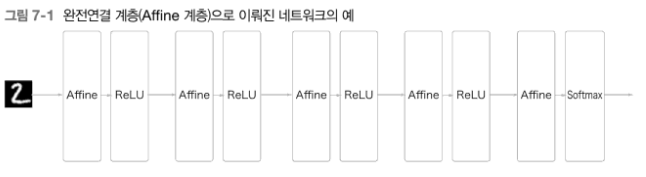
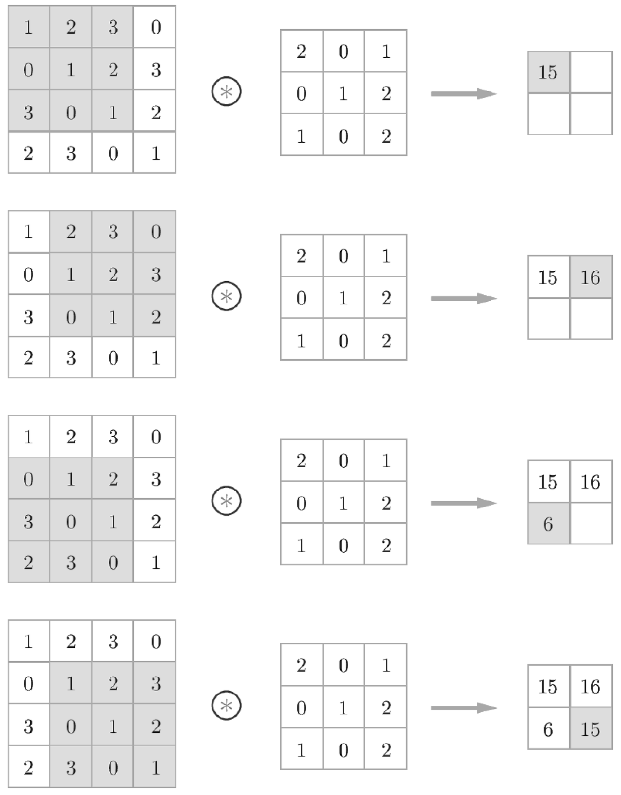
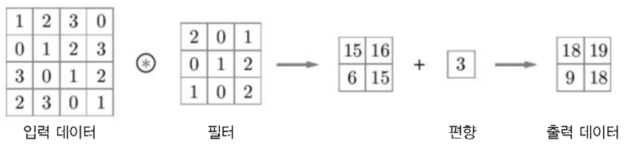
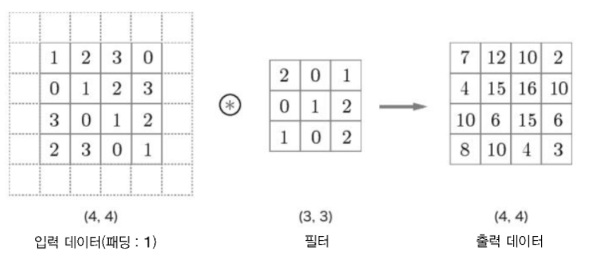
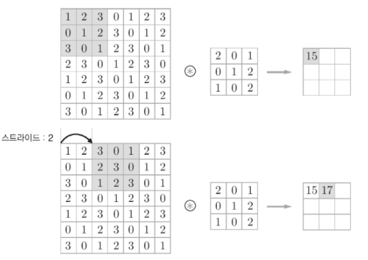
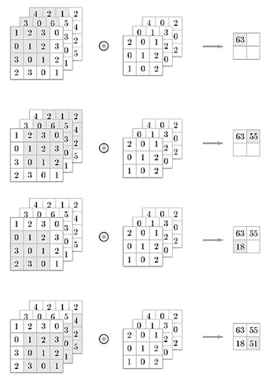
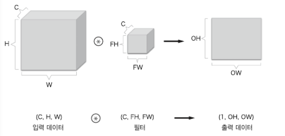
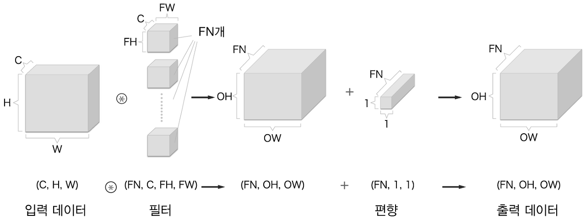
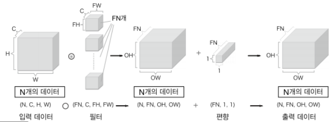

# Chapter7 합성곱 신경망(CNN)

이번 장의 주제는 합성곱 `신경망(Convolutional neural network, CNN)`이다. CNN은 이미지 인식과 음성 인식 등 다양한 곳에서 사용되며, 특히 이미지 인식 분야에서 딥러닝을 활용한 기법은
거의 다 CNN을 기초로 한다.  
이번 장에서는 CNN의 메커니즘을 자세히 설명하고 이를 파이썬으로 구현하겠다.

## 7.1 전체 구조
CNN도 지금까지 본 신경망과 같이 레고 블록처럼 계층을 조립하여 만들 수 있다. 다만 `합성곱 계층(convolutional layer)`과 `풀링 계층(pooling layer)`이 새롭게 등장한다.
이 계층에 대한 상세 설명은 다음 절에서 설명할 것이고 이번 절에서는 이 계층을 조합하여 
어떻게 CNN을 만드는지를 알아볼 것이다.

 

- 지금까지 본 신경망은 인접하는 계층의 모든 뉴런과 결합되어 있었다.
- 이를 `완전연결(fully-connected, 전결합)`이라고 하며, 완전히 연결된 계층을 Affine 계층이라는
이름으로 구현했다.
- 이 Affine 계층을 사용하여 층이 5개인 완전연결 신경망은 다음 그림과 같이 구현할 수 있다.

  

- 이제 CNN의 구조 그림을 살펴보자.

  

- 새로운 합성곱 계층(Conv)와 풀링 계층(Pooling)이 추가되었다.
- CNN의 계층은 'Conv-ReLU-(Pooling)'흐름으로 연결되며 풀링 계층은 생략하기도 한다.
- 지금까지의 'Affine-ReLU' 연결이 바뀐 것으로 봐도 무방하다.
- 또한 출력에 가까운 층에서는 지금까지의 'Affine-ReLU' 구성을 사용할 수 있다.
- 그리고 마지막 계층에서는 'Affine-Softmax' 조합을 그대로 사용한다.
- 이상은 일반적인 CNN에서 흔히 볼 수 있는 구성이다.

## 7.2 합성곱 계층
CNN에서는 padding, stride 등 CNN 고유의 용어가 등장하며 각 계층 사이에는 3차원 데이터같이 입체적인
데이터가 흐른다는 점에서 fully-connected 신경망과는 다르다.  
7.2 절에서는 CNN에서 사용하는 합성곱 계층의 구조를 살펴볼 것이다.

### 7.2.1 완전연결 계층의 문제점
- 지금까지 본 완전연결 신경망에서는 완전연결 계층(Affine 계층)을 사용했으며 완전연결 계층에서는 
인접하는 계층의 뉴런이 모두 연결되고 출력의 수는 임의로 정할 수 있었다.
- 이미지에서도 이렇게 접근하면 데이터의 형상이 무시된다.
- 예를 들어 이미지의 입력 데이터가 (1채널 , 세로 28픽셀, 가로 28픽셀)일 경우 형상이 (1, 28, 28)이지만
지금까지의 MNIST 데이터셋을 사용한 사례는 1줄로 784개의 데이터를 첫 Affine 계층에 입력했다.
- 완전 연결 계층의 경우 형상을 무시하고 모든 입력 데이터를 동등한 뉴런(같은 차원의 뉴런)으로 취급한다. 
이럴 경우 3차원 형상인 이미지에 담겨 있는 공간적 정보가 무시될 수 있다. 
예를 들어 공간적으로 가까운 픽셀은 값이 비슷하거나, RGB의 각 채널은 서로 밀접하게 관련되어 있거나, 
거리가 먼 픽셀끼리는 별 연관이 없는 등 3차원 속에서 의미를 갖는 숨어있는 본질적인 패턴이 무시된다.

> 반면에, 합성곱 계층은 형상을 유지한다. 이미지도 3차원 데이터로 입력 받으며, 마찬가지로 다음 계층에도 3차원
> 데이터로 전달한다. 그래서 CNN에서는 이미지처럼 형상을 가진 데이터를 제대로 이해할 가능성이 있는 것이다.

- CNN에서 합성곱 계층의 입출력 데이터를 `특징 맵(feature map)`이라고 한다.
- 합성곱 계층의 입력 데이터를 `입력 특징 맵(input feature map)`, 출력 데이터를 `출력 특징 맵(output feature map)`
이라고 한다.
- 여기서는 '입출력 데이터'와 '특징 맵'을 같은 의미로 사용할 것이다.

### 7.2.2 합성곱 연산
- Convolutional layer에서는 합성곱 연산을 수행한다.
- 합성곱 연산은 이미지 처리에서 말하는 `필터 연산`에 해당하며 문헌에 따라서는 이 필터를 `커널`이라고 칭하기도 한다.
- 합성곱 연산은 필터의 `윈도우`를 일정 간격으로 이동해 가며 입력 데이터에 적용한다.
- 입력과 필터에 대응하는 원소끼리 곱한 후 그 총합을 구하면 된다. (이 계산을 `단일 곱셉-누산 (fused multiply-add, FMA)`라고 한다.)
- 그리고 그 결과를 출력의 해당 장소에 저장하며 모든 과정을 그림으로 보면 다음과 같다.

  

- CNN에서는 필터의 매개변수가 그동안의 '가중치'에 해당한다.
- 그리고 CNN에도 편향이 존재하며 편향까지 포함한 계산은 다음과 같다.

  

- 이처럼 편향은 필터를 적용한 후 데이터에 더해지며 편향은 항상 하나(1*1)만 존재한다.

### 7.2.3 패딩
- 합성곱 연산을 수행하기 전에 입력 데이터 주변을 특정 값(예컨대 0)으로 채우는 작업을 `패딩(padding)`이라 한다.

  

- 이처럼 크기가 (4,4)인 입력 데이터에 패딩이 추가 되어 (6,6)이 되고, (3,3) 필터에 적용하면 (4,4) 크기의 
출력 데이터가 생성된다.
- 여기서는 패딩을 1로 설정했지만 2나 3등 원하는 정수로 설정 가능하다.

> 패딩은 주로 출력 크기를 조정할 목적으로 사용한다. 예를 들어 (4,4) 입력 데이터에 (3,3) 필터를 적용하면
> 출력은 (2,2)가 되고 이는 합성곱 연산을 되풀이할 수록 크기가 작아지면 어느 시점에서는 출력 크기가 1이 되어버린다.
> 이러한 사태를 막기 위해 패딩을 사용한다. 이처럼 패딩은 입력 데이터의 공간적 크기를 고정한 채로 다음 계층에
> 전달할 수 있다.

### 7.2.4 스트라이드
- 필터를 적용하는 위치의 간격을 `스트라이드(stride)`라고 한다.
- 지금까지 본 예는 모두 스트라이드가 1이였다.
- 스트라이드가 2인 예는 아래 그림과 같다.

  

- 위의 그림처럼 윈도우가 2칸씩 이동하는 것을 볼 수 있다.
- 위의 그림에서 볼 수 있듯이 (7,7)인 입력 데이터에 스트라이드를 2로 설정했더니 출력이 (3,3)이 되었다.
- 이처럼 스트라이드를 키우면 출력의 크기는 작아지는 반면에 패딩을 크게 하면 출력 크기가 커진다.
- 이러한 관계를 수식화해보자.
  - 입력의 크기: (H, W)
  - 필터 크기: (FH, FW)
  - 출력 크기: (OH, OW)
  - 패딩: P
  - 스트라이드: S
  - 수식
    - OH = (H + 2P - FH)/S + 1
    - OW = (W + 2P - FW)/S + 1
  
- OH, OW 값은 정수로 나눠떨어져야 한다.
- 딥러닝 프레임워크 중에는 값이 딱 나눠떨어지지 않을 때는 가장 가까운 정수로 반올림하는 등의 에러를 내지 ㅇ낳고
진행하도록 구현하는 경우도 있다.

### 7.2.5 3차원 데이터의 합성곱 연산
- 지금까지 2차원 형상을 다루는 합성곱 연산을 살펴봤다.
- 그러나 이미지만 해도 세로, 가로, 채널까지 고려한 3차원 데이터이므로 3차원 데이터를 다루는 합성곱 연산을 
다룰 것이다.
- 입력 데이터와 필터의 합성곱 연산을 채널마다 수행하고, 그 결과를 더해서 하나의 출력을 얻는다.

  

- 3차원의 합성곱 연산에서 주의할 점은 `입력 데이터의 채널 수`와 `필터의 채널 수가` 같아야 한다는 것이다.
- 이 예에서는 모두 3개로 일치하며 필터 자체의 크기는 원하는 값으로 설정 가능하다. (단, 모든 채널의 필터가 같은 크기여야 한다.)
- 이 예에서는 필터의 크기가 (3,3)이지만, 원한다면 (2,2)나 (1,1) 또는 (5,5) 등으로 설정해도 된다.

### 7.2.6 블록으로 생각하기
- 3차원의 합성곱 연산은 데이터와 필터를 직육면체 블록이라고 생각하면 쉽다.

  

- 블록은 그림과 같이 3차원 직육면체이며, 3차원 데이터를 다차원 배열로 나타낼 때는 
(C(채널), H(높이), W(너비))로 쓰겠다.
- 필터도 같은 순서로 쓰겠다. 예를 들어 채널 수 C, 필터 높이 FH, 필터 너비 FW인 경우 (C, FH, FW)로 
쓰겠다.

> 위의 그림에서는 출력 데이터는 한 장의 feature map이다. 한 장의 특징 맵을 다른 말로 하면 채널이 1개인
> 특징 맵이다. 필터(가중치)를 다수 사용한다면 합성곱 연산의 출력으로 다수의 채널을 내보낼 수 있다. 
> 여기에 편향까지 쓰인 그림으로 살펴보자.

- 이 그림과 같이 필터를 FN개 적용하면 출력 맵도 FN개가 생성된다.
- 그리고 그 FN개의 맵을 모으면 형상이 (FN, OH, OW)인 블록이 완성된다.
- 이 완성된 블록에 편향을 더해서 최종적으로 완성된 형상이 (FN, OH, OW)인 출력 데이터를 다음
계층으로 넘기겠다는 것이 CNN의 처리 흐름이다.
- 그리고 그림에서 볼 수 있듯이 편향은 채널 하나당 하나의 값으로 구성된다. 참고로 형상이 다른 블록의 덧셈은
넘파이의 브로드캐스트 기능으로 쉽게 구현할 수 있다.

### 7.2.7 배치 처리
- 신경망 처리에서는 입력 데이터 여러 개를 한 덩어리로 묶어 배치로 처리했다.
- 합성곱 연산도 마찬가지로 배치 처리를 하려고 하며 각 계층을 흐르는 데이터의 차원을 하나 늘려 4차원 데이터로
구성해보겠다.
- 데이터가 N개일 때 배치 처리를 하면 다음 그림과 같다.

  

- 각 데이터의 선두에 배치용 차원을 하나 추가했다.
- 이처럼 데이터는 4차원 형상을 가진 채 각 계층을 타고 흐르며 신경망에 4차원 데이터가 하나 흐를 때마다
데이터 N개에 대한 합성곱 연산이 이뤄진다.
- 즉, N회 분의 처리를 한번에 수행하는 배치 처리인 것이다.

## 7.3 풀링 계층
## 7.4 합성곱/풀링 계층 구현하기
## 7.5 CNN 구현하기
## 7.6 CNN 시각화하기
## 7.7 대표적인 CNN
## 7.8 정리