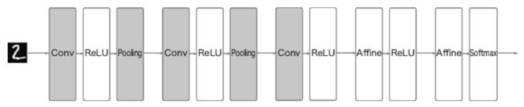

# Chapter7 합성곱 신경망(CNN)

이번 장의 주제는 합성곱 `신경망(Convolutional neural network, CNN)`이다. CNN은 이미지 인식과 음성 인식 등 다양한 곳에서 사용되며, 특히 이미지 인식 분야에서 딥러닝을 활용한 기법은
거의 다 CNN을 기초로 한다.  
이번 장에서는 CNN의 메커니즘을 자세히 설명하고 이를 파이썬으로 구현하겠다.

## 7.1 전체 구조
CNN도 지금까지 본 신경망과 같이 레고 블록처럼 계층을 조립하여 만들 수 있다. 다만 `합성곱 계층(convolutional layer)`과 `풀링 계층(pooling layer)`이 새롭게 등장한다.
이 계층에 대한 상세 설명은 다음 절에서 설명할 것이고 이번 절에서는 이 계층을 조합하여 
어떻게 CNN을 만드는지를 알아볼 것이다.

 

- 지금까지 본 신경망은 인접하는 계층의 모든 뉴런과 결합되어 있었다.
- 이를 `완전연결(fully-connected, 전결합)`이라고 하며, 완전히 연결된 계층을 Affine 계층이라는
이름으로 구현했다.
- 이 Affine 계층을 사용하여 층이 5개인 완전연결 신경망은 다음 그림과 같이 구현할 수 있다.

  

- 이제 CNN의 구조 그림을 살펴보자.

  

- 새로운 합성곱 계층(Conv)와 풀링 계층(Pooling)이 추가되었다.
- CNN의 계층은 'Conv-ReLU-(Pooling)'흐름으로 연결되며 풀링 계층은 생략하기도 한다.
- 지금까지의 'Affine-ReLU' 연결이 바뀐 것으로 봐도 무방하다.
- 또한 출력에 가까운 층에서는 지금까지의 'Affine-ReLU' 구성을 사용할 수 있다.
- 그리고 마지막 계층에서는 'Affine-Softmax' 조합을 그대로 사용한다.
- 이상은 일반적인 CNN에서 흔히 볼 수 있는 구성이다.

## 7.2 합성곱 계층

## 7.3 풀링 계층
## 7.4 합성곱/풀링 계층 구현하기
## 7.5 CNN 구현하기
## 7.6 CNN 시각화하기
## 7.7 대표적인 CNN
## 7.8 정리